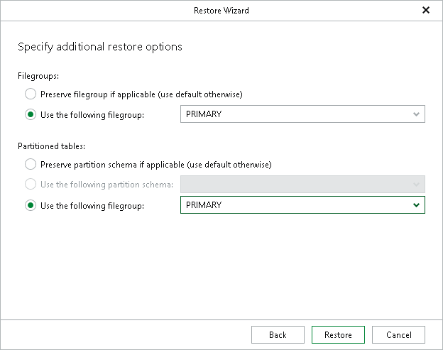

# Step 8. Specify Additional Restore Options

At this step of the wizard, specify additional restore options and click Restore.

* In the Filegroups section, select how filegroups should be restored for selected schema objects:

* Preserve filegroup if applicable — to preserve the file group state.
* Use the following filegroup — to select a file group on a target SQL Server instance.

For more information on filegroups, see [Microsoft Docs](https://learn.microsoft.com/en-us/sql/relational-databases/databases/database-files-and-filegroups?view=sql-server-ver16#filegroups).

* In the Partitioned tables section, select how partitioned tables should be restored:

* Preserve partition schema if applicable — to restore tables to the original partition schema.
* Use the following partition schema — to select a partition schema on a target SQL Server instance.
* Use the following filegroup — to select a file group on a target SQL Server instance.

