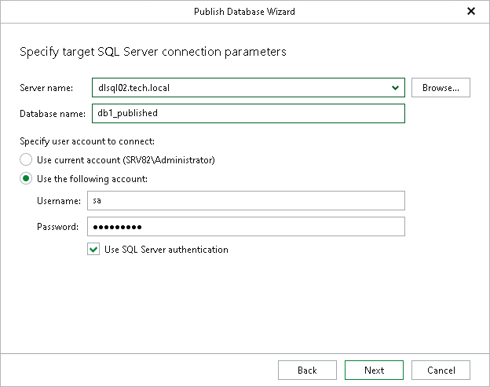
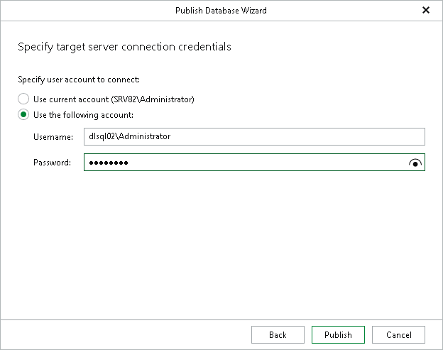

# Step 4. Specify Target Server

In this article

At this step of the wizard, do the following:

1. In the Server name field, specify a target SQL server, instance, or cluster to which you want to publish the database.

Use the <IP address\instance> or <hostname\instance> format. You can select a server, instance or cluster from the drop-down list or use the Browse button on the left, as described in [Browsing for Servers](#bfs).

1. In the Database name field, specify a new name under which you want to publish your database.

Consider that if you leave the original database name, Veeam Explorer for Microsoft SQL Server will overwrite the associated database on the target server.

1. In the Specify user account to connect section, select either of the following options:

* User current account. Select this option to connect to the specified server using the account under which Veeam Explorer for Microsoft SQL Server is running.

You cannot use this option if Veeam Explorer for Microsoft SQL Server and the mount server are located on separate machines.

* User the following account. Select this option to connect to the specified server using a custom user account. Then provide a user name and password for the account.

Make sure the account you are using has been granted the sysadmin role on the target SQL Server machine.

1. If you select the Use the following account option and want to use SQL Server authentication, select the Use SQL Server authentication check box. If you do not select the check box, you can click Publish — Veeam Explorer for Microsoft SQL Server will connect to the specified server using Windows authentication.

If you select the Use SQL Server authentication check box and provide SQL Server credentials, proceed to the next step of the wizard where you specify the target server credentials.

1. In the Specify user account to connect section, specify a user account:

* Select Use current account to connect to the specified server using the account under which Veeam Explorer for Microsoft SQL Server is running.
* Select Use the following account to connect to the specified server using a custom user account. Then provide a user name and password for the account.

1. Click Publish.

Browsing for Servers

To browse for a Microsoft SQL Server instance, perform one of the following actions:

* On the Local Servers tab, choose a Microsoft SQL Server instance that is located on the machine where Veeam Explorer for Microsoft SQL Server is opened and click Select.
* On the Network Servers tab, choose a Microsoft SQL Server instance available over the network and click Select.

Page updated 8/24/2025

Page content applies to build 13.0.1.1071
