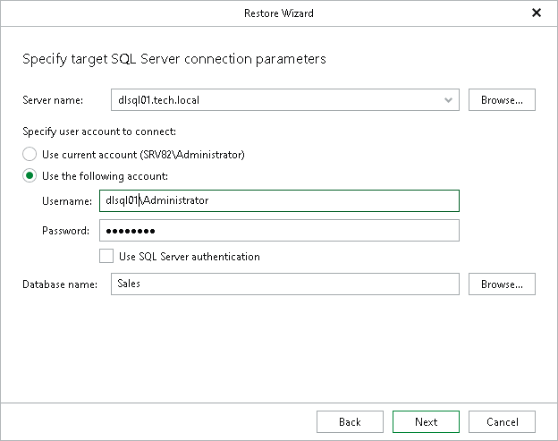

# Step 4. Specify Target SQL Server Settings

In this article

At this step of the wizard, specify the target SQL Server connection parameters:

1. In the Server name field, specify the target SQL Server instance to which you want to restore your database.

You can specify the instance name in the <IP address\instance> or <hostname\instance> format. Also, you can select an instance from the drop-down list or use the Browse button, as described in [Browsing for Servers](#bfs).

1. In the Specify user account to connect section, select either of the following options:

* Use current account. Select this option to connect to the specified server using the account under which Veeam Explorer for Microsoft SQL Server is running.

You cannot use this option if Veeam Explorer for Microsoft SQL Server and the mount server are located on separate machines.

* Use the following account. Select this option to connect to the specified server using a custom user account. Then provide a user name and password for the account.

Make sure the account you are using has been granted the sysadmin role on the target SQL Server machine.

1. If you selected the Use the following account option and want to use SQL Server authentication, select the Use SQL Server authentication check box. If you do not select the check box, Veeam Explorer for Microsoft SQL Server will use Windows authentication.
2. In the Database name field, specify the target database name. Click Browse to select a database to which you want to restore the schema.

Browsing for Servers

To browse for a Microsoft SQL Server instance, perform one of the following actions:

* On the Local Servers tab, choose a Microsoft SQL Server instance that is located on the machine where Veeam Explorer for Microsoft SQL Server is opened and click Select.
* On the Network Servers tab, choose a Microsoft SQL Server instance available over the network and click Select.

Page updated 8/24/2025

Page content applies to build 13.0.1.1071
