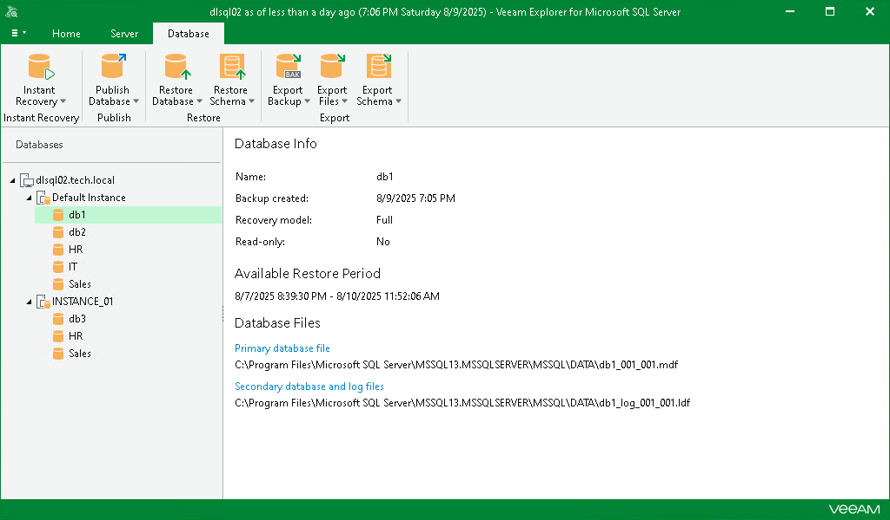

# Viewing Database Information

In this article

To get information about databases, select a database in the navigation pane and review database info in the preview pane.

Page updated 8/10/2025

Page content applies to build 13.0.1.1071
