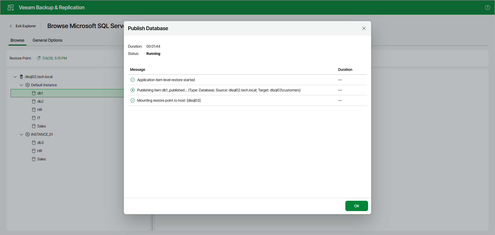
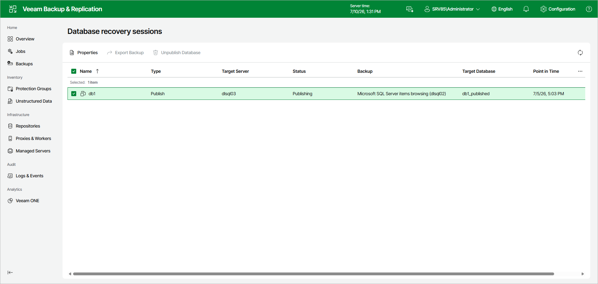

# Managing Publishing Session

After you finish the steps of the Publish Database wizard, Veeam Explorer for Microsoft SQL Server starts a publishing session that shows the progress of the operation.

Note that clicking OK or closing the session window does not interrupt the operation.

You can manage and track the session progress in the Veeam Backup & Replication web UI.

To do this, open the Veeam Backup & Replication web UI and in the management pane, click DB Recovery.

In the Database recovery sessions view, you can find ongoing recovery sessions.

For ongoing publishing sessions, you can do the following:

* [View publishing session details](vesql_web_ui_publish_manage_properties.md).
* [Export data from the published databases](vesql_publish_web_ui_export.md).
* [Unpublish databases](vesql_publish_web_ui_unpublish.md).

Page updated 2026-07-10

