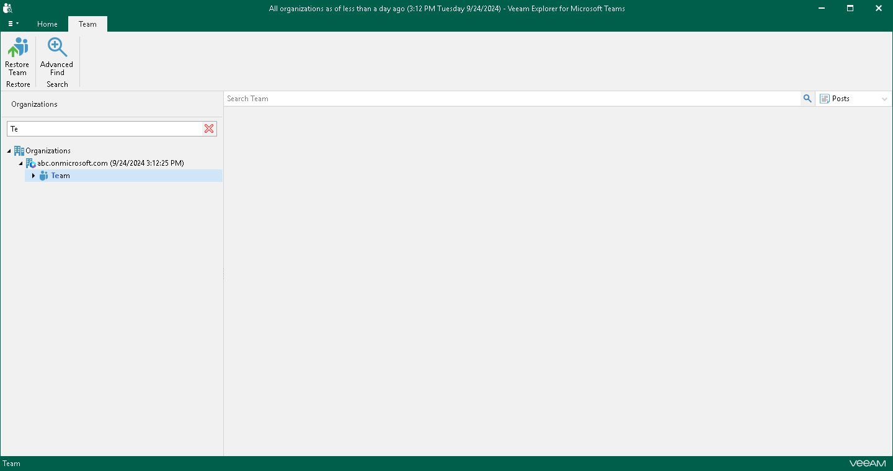
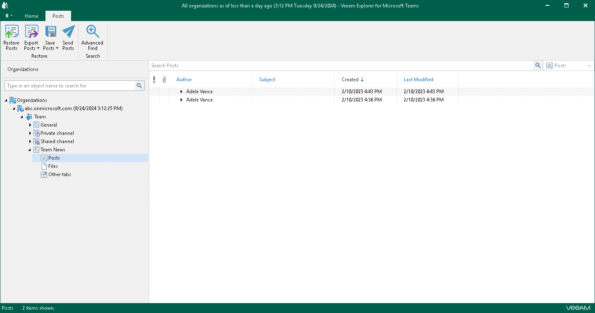
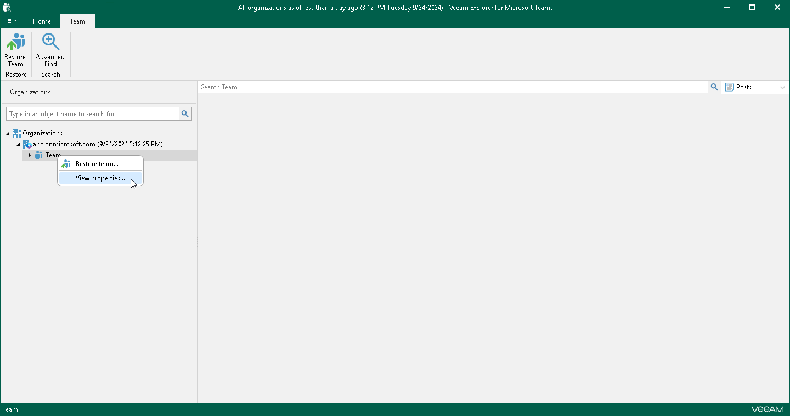
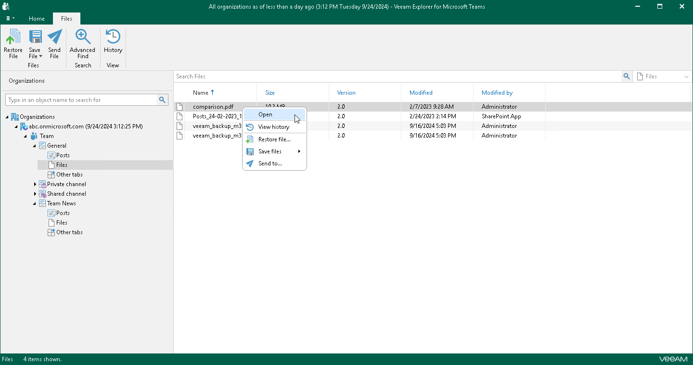
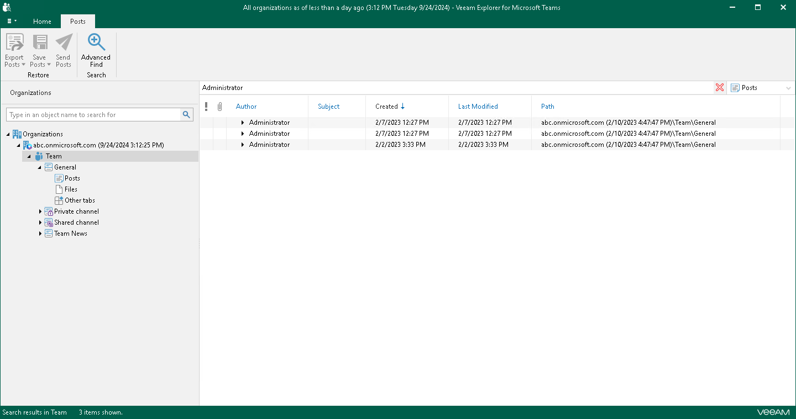
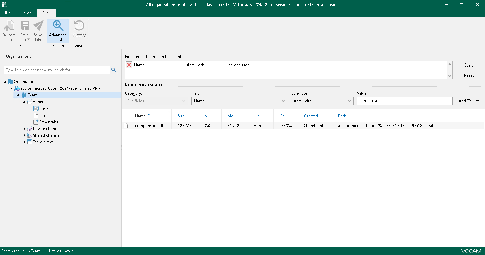

# Browsing, Searching and Viewing Items

You can use Veeam Explorer for Microsoft Teams to view the contents of a backup file, view team properties, open posts and files, search for teams and for items in a backup file as well as customize criteria of your search.

Searching for Teams

You can use keywords to search for teams in the database structure containing your Microsoft Teams objects. To do this, enter a search query in the search field at the top of the navigation pane.

To remove a keyword, click the cross mark.

Browsing Backup Content

To view the contents of a backup file, you use the navigation pane which displays the database structure containing your Microsoft Teams objects: teams, channels and channel tabs. Veeam Explorer for Microsoft Teams groups channel tabs in the following nodes of the navigation pane:

* Posts. Contains the Posts tab of the channel.
* Files. Contains the Files tab of the channel.
* Other tabs. Contains other tabs of the channel that link to sites, documents, applications, and and other objects.

After you select an object in the navigation pane, you can see its content in the preview pane.

Viewing Team Properties

You can view properties of a backed-up team. This may be useful, for example, in case you want to decide whether to restore team properties during restore of a team.

To view team properties, in the navigation pane, right-click a necessary team and select View properties.

Opening Posts and Files

You can use Veeam Explorer for Microsoft Teams to open backed-up posts and files.

To open a post or file, do the following:

1. In the navigation pane, browse to the channel whose post or file you want to open and click the necessary node: Posts or Files.
2. In the preview pane, right-click a post or file and select Open.

Searching for Objects in Backup File

The search mechanism allows you to find items (posts, files and tabs) matching specified search criteria.

To search for required items, do the following:

1. In the navigation pane, do one of the following:

* Select a node that contains an item you want to find: Posts, Files or Other tabs

* Select a team or channel whose items you want to find. Then, from the drop-down list next to the search field, select what type of items you want to find: Files, Posts or Other tabs.

1. Enter a search query in the search field.

Consider the following:

* You can use double quotes to find the exact phrase. For example, "Document".
* You can narrow search results by specifying various search criteria using the criteria:value format. For more information about search parameters, see the [Appendix A. Item Search Parameters](https://helpcenter.veeam.com/docs/vbo365/guide/appendix_search.html?ver=80) section of the Veeam Backup for Microsoft 365 User Guide. For example, author:"Administrator".
* You can use logical upper-cased operators such as AND, OR and NOT along with wildcard characters such as \* and ?.

For example:

* meeting AND author:"Administrator" — returns objects that include both specified keywords.
* meeting OR author:"Administrator" — returns objects that include one of the specified keywords.
* NOT author:"Administrator" — excludes objects specified by a keyword.
* hasattachment:compar\* — returns all objects that contain an attachment and the attachment name is started with compar.

* ?all — returns all objects that contain the specified keyword with any alphabet in the first position.

Using Advanced Find

The Advanced Find mechanism allows you to define your search criteria more precisely.

|  |
| --- |
| Note |
| The Advanced Find mechanism is supported for posts and files only. The mechanism is not supported for tabs. |

Consider the following:

* Logical upper-cased operators such as AND, OR and NOT are not supported in the Value field. You can specify the text keyword only.
* You can create multiple filters. If you selected the same search criteria from the Category, Field or Condition lists, the OR operator is applied to process such filters. If the search criteria are different, the AND operator is applied.

For example, to find a file whose name starts with comparison, do the following:

1. In the preview pane, select a node and click Advanced Find on the ribbon.
2. In the Define search criteria section, select Category > File fields.
3. From the Field list, select Name.
4. From the Condition list, select starts with.
5. In the Value field, specify a file name.
6. Click Add to List and then click Start.

To remove a filter, click the cross mark next to it. To remove all configured filters, click Reset.

