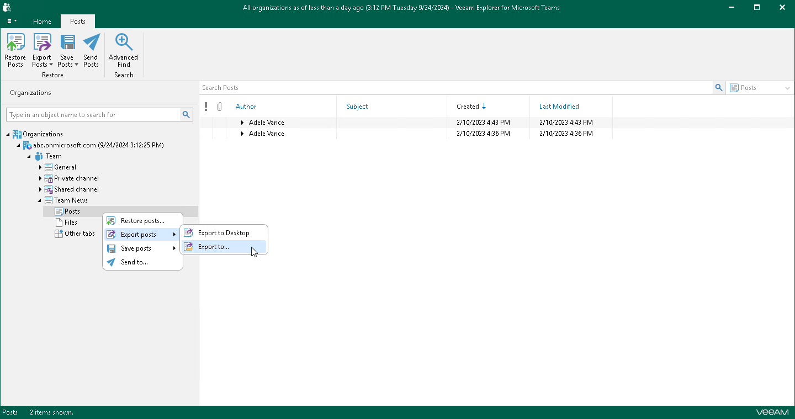
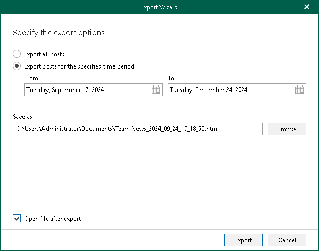
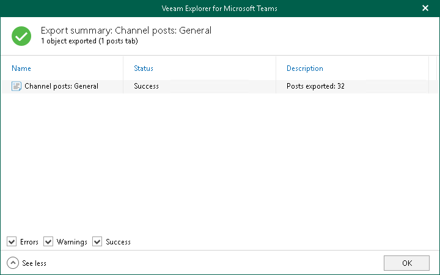

# Exporting Multiple Posts

To export posts of a channel, do the following:

1. In the navigation pane, expand a channel whose posts you want to export.
2. In the navigation pane, do one of the following:

* Select Posts, and on the Posts tab, click Export Posts and select how you want to export posts:

* Export to Desktop. Select this option if you want to perform the 1-Click Export operation. Veeam Explorer for Microsoft Teams will immediately export all posts of the channel to the Desktop folder.
* Export to. Select this option if you want to specify what posts to export and where to export posts.

* Right-click Posts and select Export posts > Export to Desktop or Export posts > Export to.

1. If you selected the Export to option at the step 2, in the Export wizard, do the following:

1. Specify what posts you want to export. You can select from the following options:

* Export all posts. If you select this option, Veeam Explorer for Microsoft Teams will export all posts published in the channel to an HTML file.
* Export posts for the specified time period. If you select this option, you can define a time period when posts that you want to export were created. To do this, specify the start date and end date of the period in the From and To fields. Veeam Explorer for Microsoft Teams will export posts whose last modification date belongs to the specified period.

1. In the Save as field, click Browse and browse to a folder where you want to save an HTML file with exported posts. By default, Veeam Explorer for Microsoft Teams exports posts to a file with the following name: <Channel\_name>\_<date\_and\_time>.html. For example: Team News\_2024\_09\_24\_19\_18\_50.html.
2. Select the Open file after export check box if you want to open the resulting HTML file right after the export operation is completed.
3. Click Export.

1. After the export process is complete, review the results shown in the Export summary window. To do this, click See more to expand the window and review details of the export operation. You can filter notifications by their status: Error, Warning or Success.

