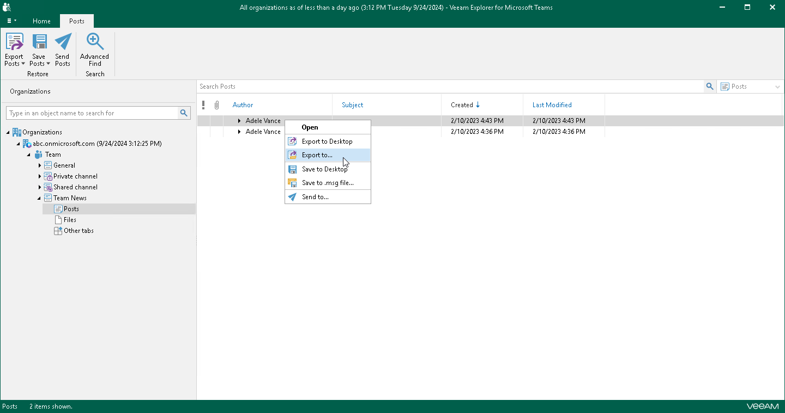
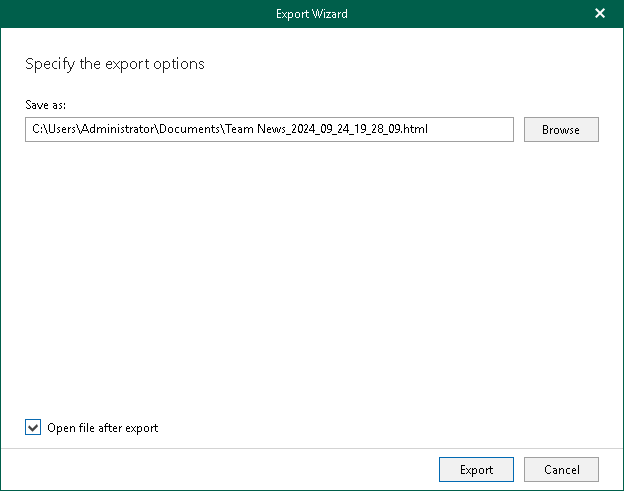
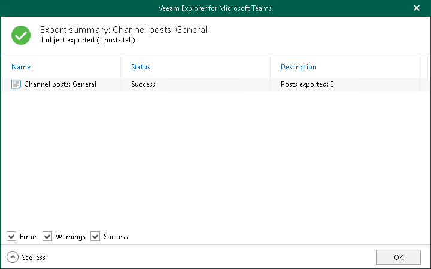

# Exporting Individual Posts

To export a specific post of a channel, do the following:

1. In the navigation pane, expand a channel whose post you want to export and select Posts.
2. In the preview pane, do one of the following:

* Select a necessary post, and on the Posts tab, click Export Posts and select how you want to export the post:

* Export to Desktop. Select this option if you want to perform the 1-Click Export operation. Veeam Explorer for Microsoft Teams will immediately export the post to the Desktop folder.
* Export to. Select this option if you want to export the post to a custom location.

* Right-click a necessary post and select Export to Desktop or Export to.

|  |
| --- |
| Tip |
| To select more than one post in the preview pane, press and hold the [Ctrl] key and select the necessary posts. |

1. If you selected the Export to option at the step 2, in the Export wizard, do the following:

1. In the Save as field, click Browse and browse to a folder where you want to save an HTML file with exported posts. By default, Veeam Explorer for Microsoft Teams exports posts to a file with the following name: <Channel\_name>\_<date\_and\_time>.html. For example: Team News\_2024\_09\_24\_19\_28\_09.html.
2. Select the Open file after export check box if you want to open the resulting HTML file right after the export operation is completed.
3. Click Export.

1. After the export process is complete, review the results shown in the Export summary window. To do this, click See more to expand the window and review details of the export operation. You can filter notifications by their status: Error, Warning or Success.

