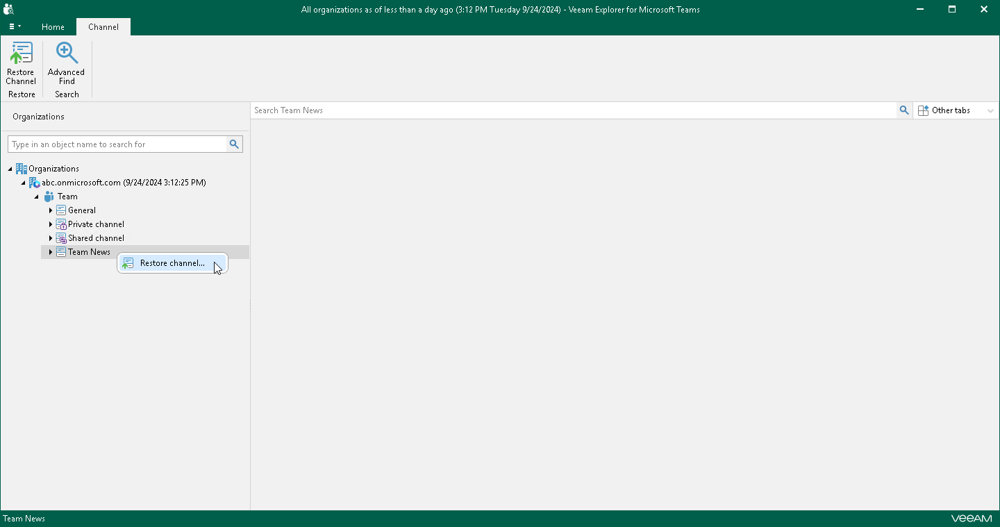
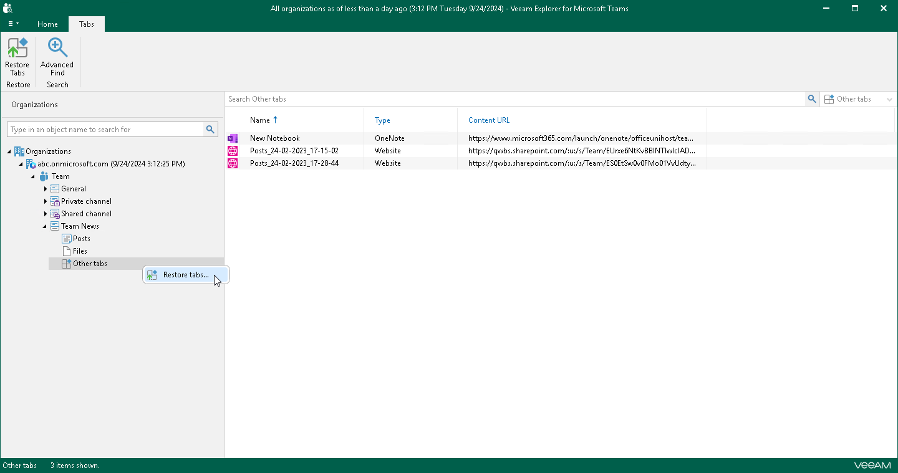
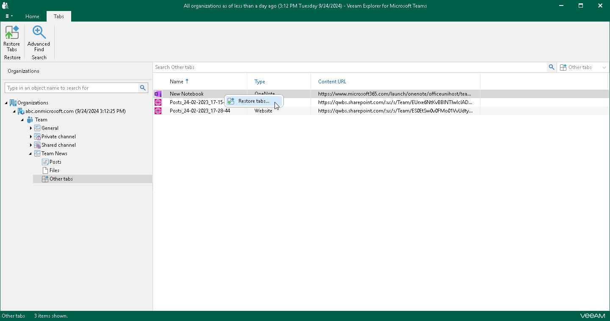

# Step 1. Launch Restore Wizard

In this article

To launch the Restore wizard, do the following:

* If you want to restore a channel, do one of the following:

* In the navigation pane, select a channel that you want to restore, and on the Channel tab, click Restore Channel.
* In the navigation pane, right-click a channel that you want to restore and select Restore channel.

* If you want to restore all tabs of a channel, do one of the following:

* In the navigation pane, expand a channel whose tabs you want to restore, select Other tabs, and on the Tabs tab, click Restore Tabs.
* In the navigation pane, expand a channel whose tabs you want to restore, right-click Other tabs and select Restore tabs.

* If you want to restore individual tabs of a channel, do the following:

1. In the navigation pane, expand a channel whose tabs you want to restore and select Other tabs.
2. In the preview pane, do one of the following:

* Select a necessary tab, and on the Tabs tab, click Restore Tabs.
* Right-click a tab and select Restore tabs.

|  |
| --- |
| Tip |
| To select more than one tab in the preview pane, press and hold the [Ctrl] key and select the necessary tabs. |

Page updated 2/14/2025

Page content applies to build 13.0.1.1071
