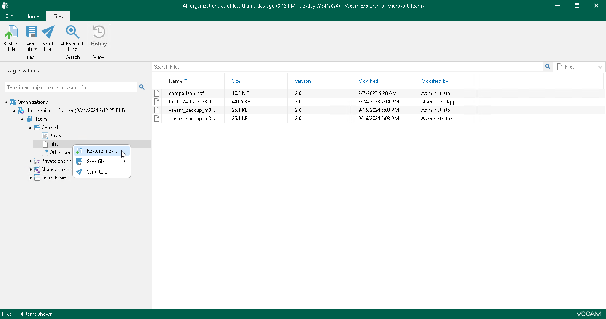
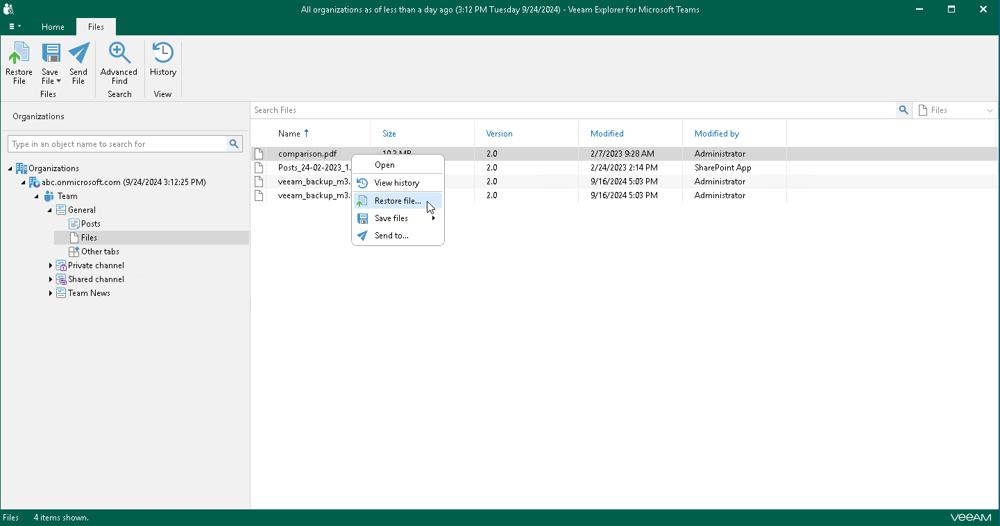

# Step 1. Launch Restore Wizard

In this article

To launch the Restore wizard, do the following:

* If you want to restore all files of a channel, do one of the following:

* In the navigation pane, expand a channel whose files you want to restore, select Files, and on the Files tab, click Restore File.
* In the navigation pane, expand a channel whose files you want to restore, right-click Files and select Restore files.

* If you want to restore individual files, do the following:

1. In the navigation pane, expand a channel whose files you want to restore and select Files.
2. In the preview pane, do one of the following:

* Select a necessary file, and on the Files tab, click Restore File.
* Right-click a file and select Restore file.

|  |
| --- |
| Tip |
| To select more than one file in the preview pane, press and hold the [Ctrl] key and select the necessary files. |

Page updated 2/14/2025

Page content applies to build 13.0.1.1071
