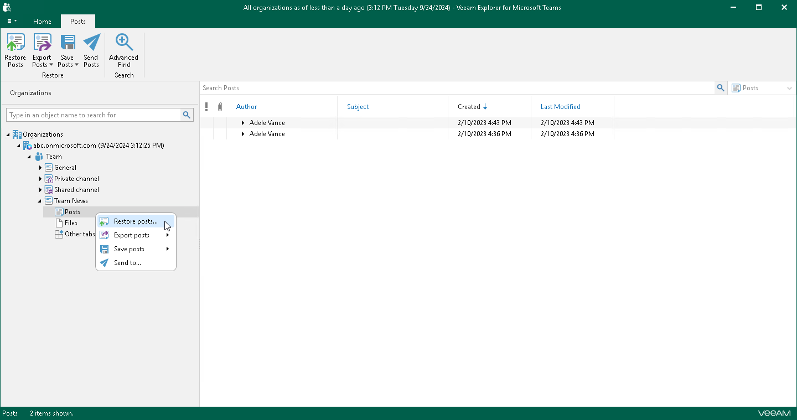

# Step 1. Launch Restore Wizard

To launch the Restore wizard, do one of the following:

* In the navigation pane, expand a channel whose posts you want to restore, select Posts, and on the Posts tab, click Restore Posts.
* In the navigation pane, expand a channel whose posts you want to restore, right-click Posts and select Restore posts.

