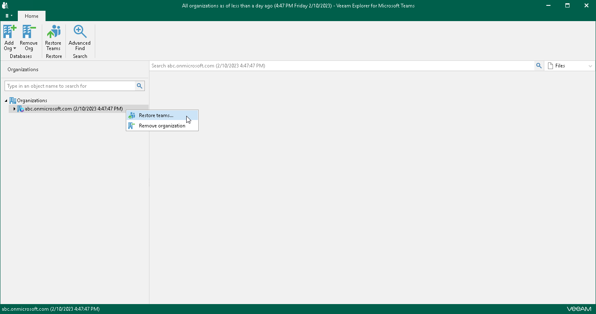
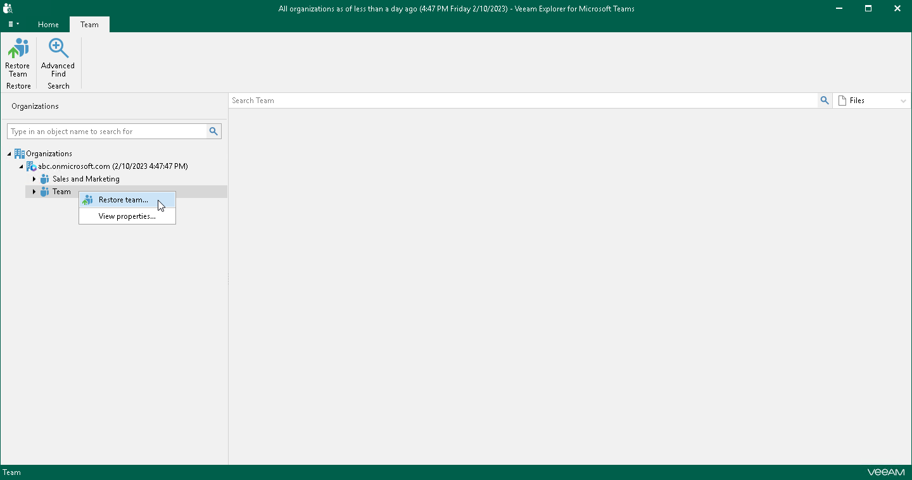

# Step 1. Launch Restore Wizard

To launch the Restore wizard, do the following:

* If you want to restore multiple teams of a Microsoft 365 organization, do one of the following:

* In the navigation pane, select an organization whose teams you want to restore, and on the Home tab, click Restore Teams.
* In the navigation pane, right-click an organization whose teams you want to restore and select Restore teams.

* If you want to restore a specific team, do one of the following:

* In the navigation pane, select a team that you want to restore, and on the Team tab, click Restore Team.
* In the navigation pane, right-click a team that you want to restore and select Restore team.

