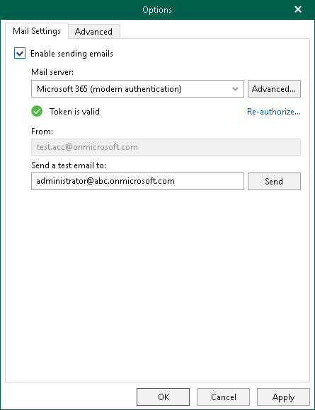

# Microsoft 365 Account

You can authorize Veeam Explorer for Microsoft Teams to send Microsoft Teams posts and files as attachments on behalf of your Microsoft 365 account. To send email messages, Veeam Explorer for Microsoft Teams communicates with the Microsoft Graph API. For authentication, Veeam Explorer for Microsoft Teams uses an access token issued by Microsoft Identity platform. To acquire an access token, you can either use an application preinstalled by Veeam Backup & Replication or specify details of the custom Microsoft Entra application registered in Microsoft Identity platform. For more information on obtaining client credentials, see [Registering Application in Microsoft Identity Platform](vet_register_app_azure.md).

|  |
| --- |
| Note |
| Sending email notifications on behalf of your Microsoft 365 account is not supported in Microsoft Entra ID for US Government GCC High and Microsoft Entra China regions. |

To configure sending email messages on behalf of your Microsoft 365 account, do the following:

1. In the main menu, click General Options.
2. Open the Mail Settings tab.
3. Select the Enable sending emails check box.
4. From the Mail server drop-down list, select Microsoft 365 (modern authentication).
5. Do one of the following:

* To use an application preinstalled by Veeam Backup & Replication, click Authorize now and enter credentials of your Microsoft 365 account to complete authentication.

* To use the custom application, click Advanced to specify [the advanced settings](#advanced), then click Authorize now and enter credentials of your Microsoft 365 account to complete authentication.

1. In the From field, review the email address to be shown as a sender.

|  |
| --- |
| Note |
| You can change the sender email address. To send email notifications on behalf of another Microsoft 365 account, click Re-authorize and use another email address to sign in. |

1. In the Send a test email to field, specify the email address to which Veeam Explorer for Microsoft Teams sends a test email message.
2. Click Send to send a test email message.
3. Click OK.

Configuring Advanced Settings

In the Microsoft 365 Application Settings window, select the Use custom application registration settings check box and specify the following:

1. In the Application client ID field, specify an identification number of your Microsoft Entra application. You can find this number in an application settings in your Microsoft Entra ID. For more information, see [this Microsoft article](https://docs.microsoft.com/en-us/azure/active-directory/develop/howto-create-service-principal-portal).
2. In the Tenant ID field, specify the Microsoft Entra tenant ID.

