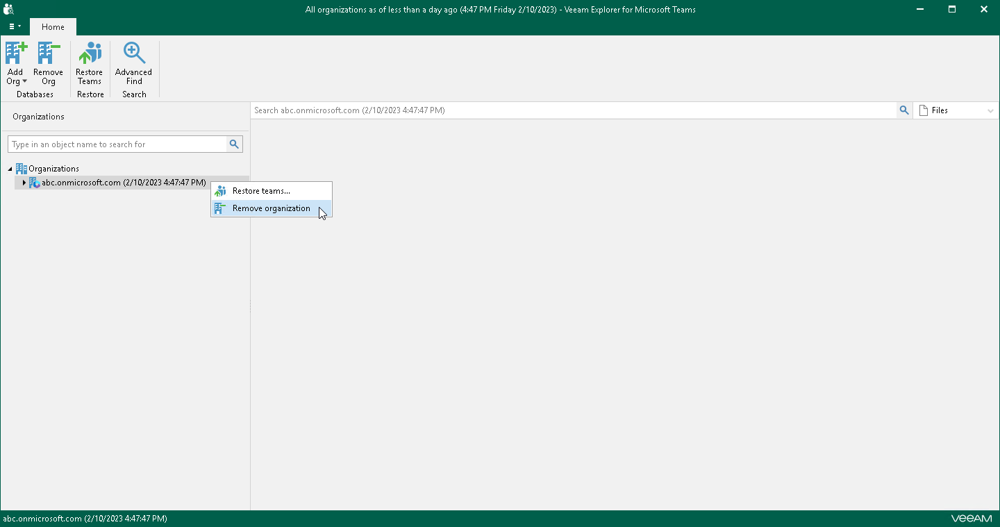

# Removing Organizations

Veeam Explorer for Microsoft Teams allows you to remove an organization from the application scope when you no longer need it.

To remove an organization from the application scope, right-click an organization in the navigation pane and select Remove organization.

