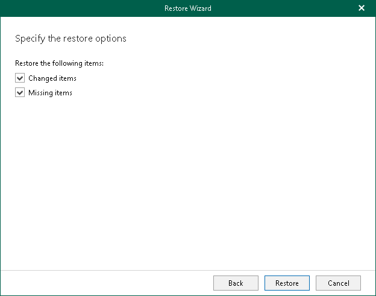
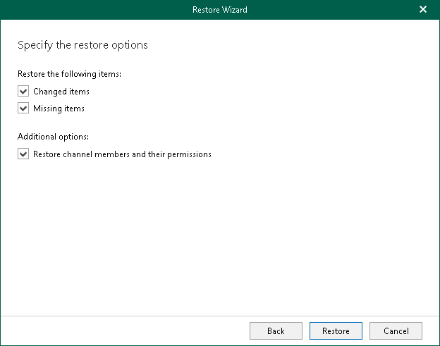

# Step 4. Specify Restore Options

In this article

At this step of the wizard, specify data restore options and start the restore operation:

1. Select the Changed items check box if you want to restore items that have changed since the time when the backup was created. When you select this option, Veeam Explorer for Microsoft Teams overwrites existing items in your target location.
2. Select the Missing items check box if you want to restore items that are missing in the target location. For example, some of the items were removed and you want to restore them from the backup.
3. [For private and shared team channels] Select the Restore channel members and their permissions check box if you want to restore channel members and their permissions.
4. Click Restore.

|  |
| --- |
| Note |
| During restore of a tab, Veeam Explorer for Microsoft Teams restores the name of the tab and a link to an object published on the tab. The object itself, for example, a SharePoint site or document, is not restored from the backup in this scenario. To restore such objects along with tabs, consider restoring an entire team. For more information, see [Restoring Teams](vet_restore_teams.md). |

For team channels and the Other tabs tab:

For private and shared team channels:

Page updated 6/27/2025

Page content applies to build 13.0.1.1071
