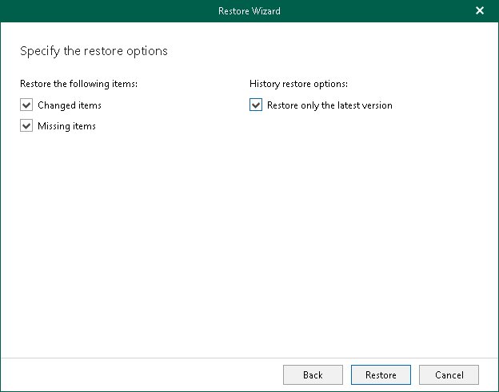

# Step 4. Specify Restore Options

In this article

At this step of the wizard, specify data restore options and start the restore operation:

1. Select the Changed items check box if you want to restore items that have changed since the time when the backup was created.
2. Select the Missing items check box if you want to restore items that are missing in the target location. For example, some of the items were removed and you want to restore them from the backup.
3. By default, Veeam Explorer for Microsoft Teams restores all versions of backed-up files from the backup. If you want to restore only the latest version of a file, select the Restore only the latest version check box. If you select this option, Veeam Explorer for Microsoft Teams will merge original files in the production environment with the latest version of the files in the backup.
4. Click Restore.

Page updated 12/18/2024

Page content applies to build 13.0.1.1071
