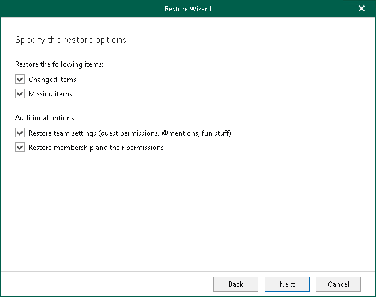

# Step 5. Specify Restore Options

In this article

At this step of the wizard, specify data restore options:

1. Select the Changed items check box if you want to restore items that have changed since the time when the backup was created. When you select this option, Veeam Explorer for Microsoft Teams overwrites existing items in the original team.
2. Select the Missing items check box if you want to restore items that are missing in the original team. For example, some of the items were removed and you want to restore them from the backup.
3. Select the Restore team settings check box if you want to replace the current team settings with team settings from the backup. For information on how to view team settings in the backup, see [Viewing Team Properties](vet_browsing_and_searching.md#ViewingItemDetails).

Keep in mind that you cannot select this check box if both the Changed items and Missing items check boxes are cleared.

1. If you want to restore information about team members and their roles from the backup, make sure that the Restore membership and their permissions check box is selected.

* If you launched the Restore wizard to restore a specific team, you will be able to review team members at the [next step](vet_restore_select_members.md) of the wizard. Click Next.
* If you launched the Restore wizard to restore multiple teams, you cannot review team members. Click Restore to start the restore operation.

Note that you cannot proceed to the [next step](vet_restore_select_members.md) or start the restore operation, if you clear both the Changed items and Missing items check boxes.

|  |
| --- |
| Tip |
| If you clear the Restore membership and their permissions check box, you can start the restore operation immediately. To do this, click Restore. |

Page updated 8/14/2025

Page content applies to build 13.0.1.1071
