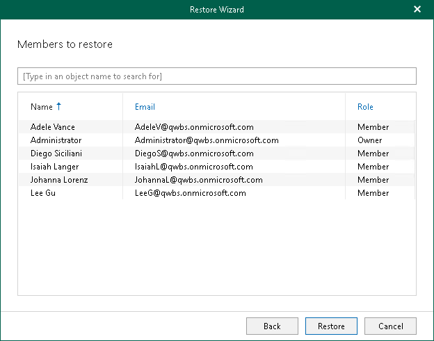

# Step 6. Review Team Members

In this article

This step is only available if you launched the Restore wizard to restore a specific team and selected the Restore membership and their permissions check box at the [previous step](vet_restore_options_teams.md) of the wizard.

At this step of the wizard, review the list of users whose membership and roles in the team will be restored and click Restore.

To quickly find the necessary team members, use the search field at the top of the wizard window.

|  |
| --- |
| Note |
| Veeam Explorer for Microsoft Teams does not change roles for team owners during restore. For example, you create a backup of your organization, and then change role for a team member from Member to Owner. In this case, if you choose to restore this team member from the backup, Veeam Explorer for Microsoft Teams will not set their role to Member.  In the opposite case, if a team member role was changed from Owner to Member after the backup was created, and you choose to restore team membership from the backup, Veeam Explorer for Microsoft Teams will elevate the role to Owner during restore. |

Page updated 9/20/2024

Page content applies to build 13.0.1.1071
