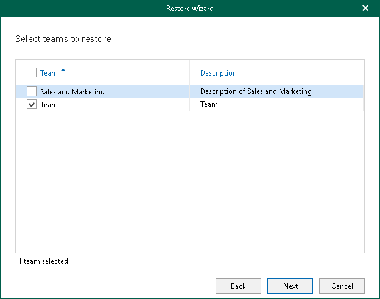

# Step 4. Select Teams

In this article

This step is only available if you launched the Restore wizard to restore multiple teams.

At this step of the wizard, select check boxes next to the teams that you want to restore.

Page updated 10/6/2025

Page content applies to build 13.0.1.1071
