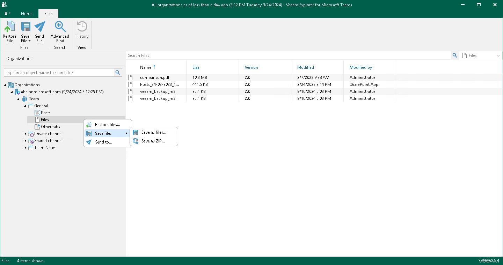
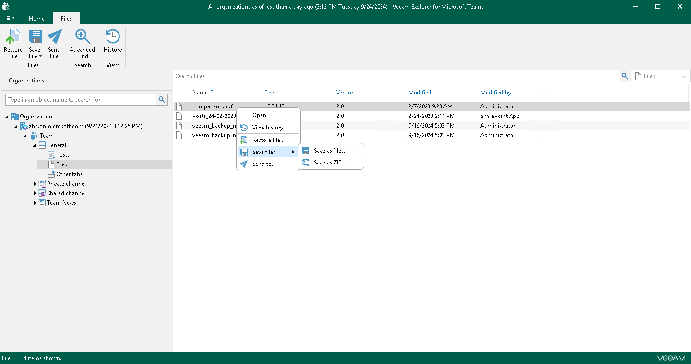

# Saving Files

In this article

You can use Veeam Explorer for Microsoft Teams to save files published in a team channel to a specified location. You can save all files of a channel or specific posts.

Saving All Files of Channel

To save files published in a team channel, do the following:

1. In the navigation pane, expand a channel whose files you want to save.
2. In the navigation pane, do one of the following:

* Select Files, and on the Files tab, click Save File and select how you want to save files:

* Save as files. Select this option if you want to save each file separately to a specified location. To specify a location, in the displayed window, browse to the necessary folder and click Select Folder.

* Save as ZIP. Select this option if you want to add saved files to a ZIP archive and save the resulting archive to a specified location. To specify a location, in the displayed window, browse to the necessary folder and click Save. Veeam Explorer for Microsoft Teams will save files to an archive with the <channel\_name>.zip name.

* Right-click Files and select Save files > Save as files or Save files > Save as ZIP.

Saving Individual Files

To save a specific file published in a team channel, do the following:

1. In the navigation pane, expand a channel whose files you want to save and select Files.
2. In the preview pane, do one of the following:

* Select a necessary file, and on the Files tab, click Save File and select how you want to save files:

* Save as files. Select this option if you want to save each file separately to a specified location. To specify a location, in the displayed window, browse to the necessary folder and click Select Folder.

* Save as ZIP. Select this option if you want to add saved files to a ZIP archive and save the resulting archive to a specified location. To specify a location, in the displayed window, browse to the necessary folder and click Save. Veeam Explorer for Microsoft Teams will save files to an archive with the archive.zip name.

* Right-click a necessary file and select Save file > Save as files or Save file > Save as ZIP.

|  |
| --- |
| Tip |
| To select more than one file in the preview pane, press and hold the [Ctrl] key and select the necessary files. |

Page updated 10/31/2025

Page content applies to build 13.0.1.1071
