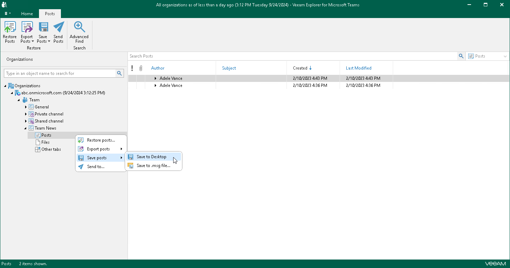
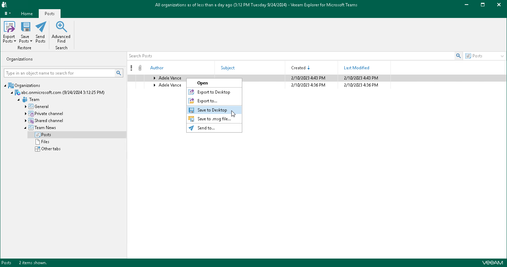

# Saving Posts

In this article

You can use Veeam Explorer for Microsoft Teams to save posts published in a team channel as Microsoft Exchange Mail Document (.msg) files. You can save all posts of a channel or specific posts. Veeam Explorer for Microsoft Teams saves each post to a separate .msg file in the specified location.

Saving All Posts of Channel

To save posts published in a team channel, do the following:

1. In the navigation pane, expand a channel whose posts you want to save.
2. In the navigation pane, do one of the following:

* Select Posts, and on the Posts tab, click Save Posts and select where you want to save posts:

* Save to <folder\_name>. Select this option if you want to perform the 1-Click Save operation. Veeam Explorer for Microsoft Teams will save posts to the latest location that was used when saving posts. If you have not saved posts yet, Veeam Explorer for Microsoft Teams save posts to the Desktop folder.
* Save to .msg file. Select this option if you want to save posts to a custom location. To specify a location, in the displayed window, browse to the necessary folder and click Select Folder.

* Right-click Posts and select Save posts > Save to <folder\_name> or Save posts > Save to .msg file.

Saving Individual Posts

To save a specific post published in a team channel, do the following:

1. In the navigation pane, expand a channel whose post you want to save and select Posts.
2. In the preview pane, do one of the following:

* Select a necessary post, and on the Posts tab, click Save Posts and select where you want to save posts:

* Save to <folder\_name>. Select this option if you want to perform the 1-Click Save operation. Veeam Explorer for Microsoft Teams will save posts to the latest location that was used when saving posts. If you have not saved posts yet, Veeam Explorer for Microsoft Teams save posts to the Desktop folder.
* Save to .msg file. Select this option if you want to save posts to a custom location. To specify a location, in the displayed window, browse to the necessary folder and click Select Folder.

* Right-click a necessary post and select Save to <folder\_name> or Save to .msg file.

|  |
| --- |
| Tip |
| To select more than one post in the preview pane, press and hold the [Ctrl] key and select the necessary posts. |

Page updated 10/31/2025

Page content applies to build 13.0.1.1071
