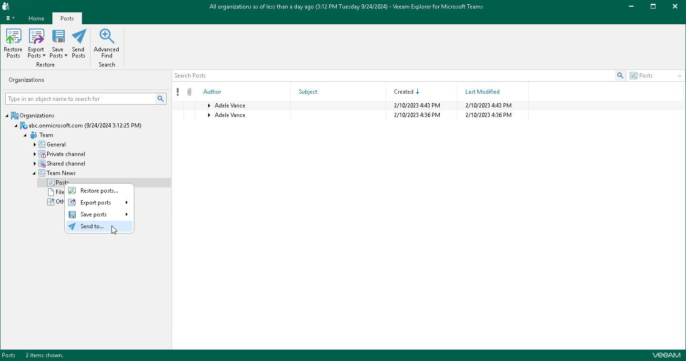
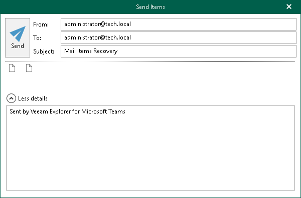
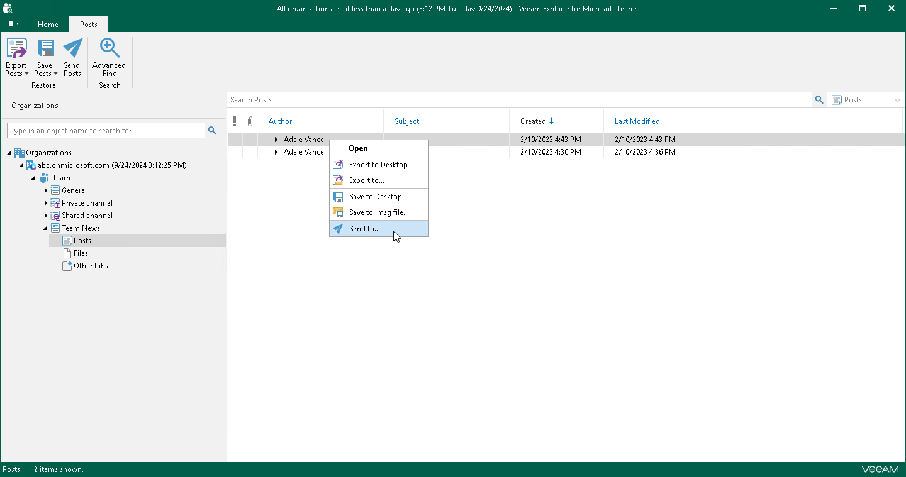

# Sending Posts and Files

In this article

You can use Veeam Explorer for Microsoft Teams to send posts and files published in a team channel to specified recipients by email. You can send all posts or files of a channel or send individual posts or files.

|  |
| --- |
| Note |
| Before sending documents, make sure to configure mail settings. The amount of data you can send at a time depends on your SMTP server configuration. For more information about configuring mail settings, see [Mail Settings](vet_mail_settings.md). |

Sending All Posts or Files of Channel

To send all posts or files of a team channel by email, do the following:

1. In the navigation pane, expand a channel whose posts or files you want to send.
2. Depending on the type of object you want to send, the following actions are available:

* To send posts, do one of the following:

* In the navigation pane, select Posts, and on the Posts tab, click Send Posts.
* In the navigation pane, right-click Posts and select Send to.

* To send files, do one of the following:

* In the navigation pane, select Files, and on the Files tab, click Send File.
* In the navigation pane, right-click Files and select Send to.

1. In case the size of the message with files exceeds the size allowed by your SMTP server configuration, Veeam Explorer for Microsoft Teams will prompt whether you want to send files. In the notification window, click Yes.
2. In the Send Items window, provide a recipient address.

The From field is filled automatically based on the address you have provided when configuring mail settings.

You can also edit the message subject and body. To edit the message body, click More details.

Sending Individual Posts or Files

To send a specific post or file of a team channel by email, do the following:

1. In the navigation pane, expand a channel whose post or file you want to send and select Posts or Files.
2. Depending on the type of object you want to send, the following actions are available:

* To send a post, do one of the following:

* In the preview pane, select a necessary post, and on the Posts tab, click Send Posts.
* In the preview pane, right-click a necessary post and select Send to.

* To send a file, do one of the following:

* In the preview pane, select a necessary file, and on the Files tab, click Send File.
* In the preview pane, right-click a necessary file and select Send to.

1. In the Send Items window, provide a recipient address.

The From field is filled automatically based on the address you have provided when configuring mail settings.

You can also edit the message subject and body. To edit the message body, click More details.

Page updated 10/31/2025

Page content applies to build 13.0.1.1071
