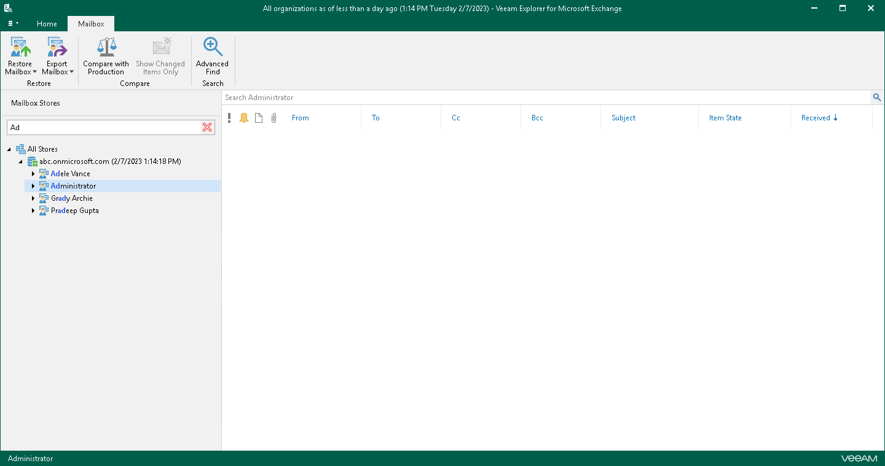
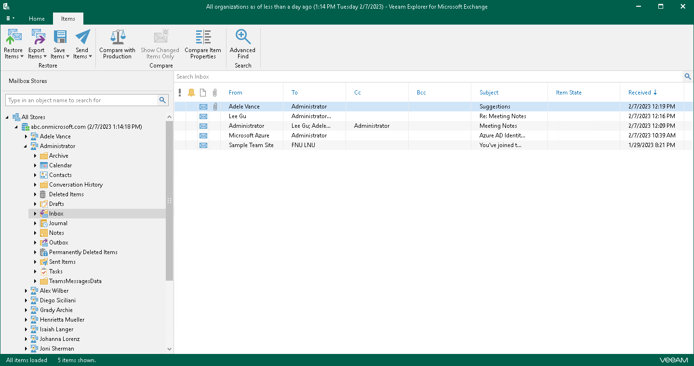
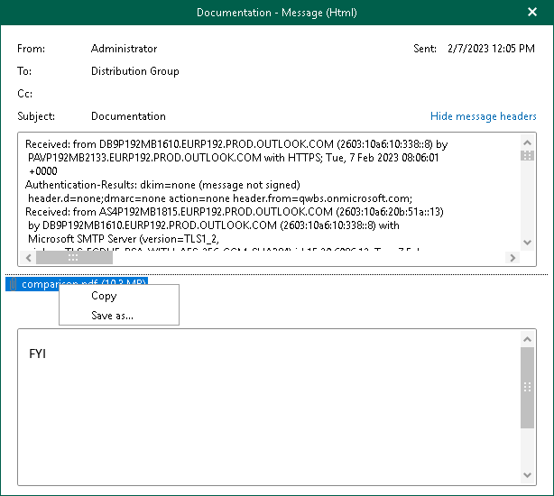
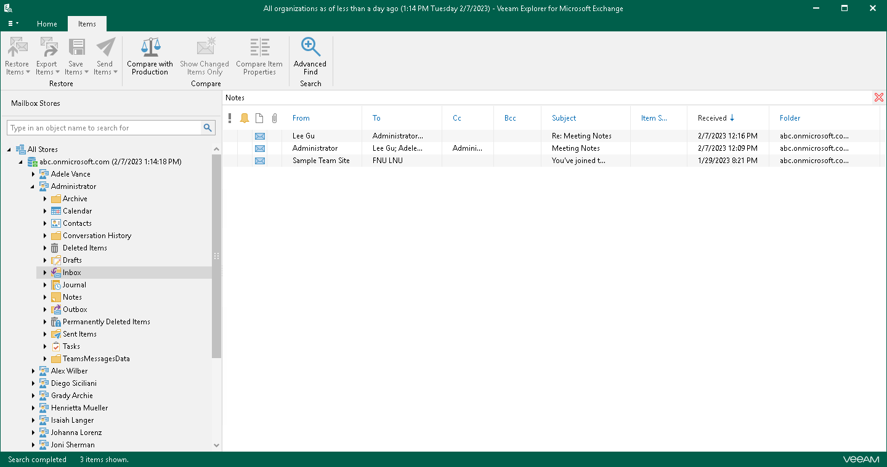
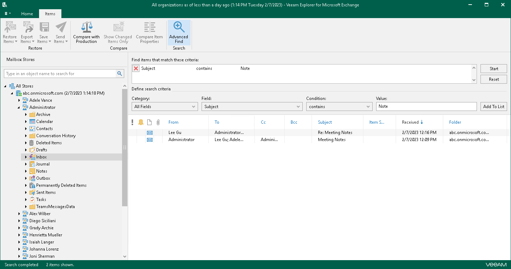

# Browsing, Searching and Viewing Items

You can use Veeam Explorer for Microsoft Exchange to view the contents of a backup file, open messages, search for mailboxes and for items in a backup file as well as customize criteria of your search.

Searching for Mailboxes

You can use keywords to search for mailboxes in the database structure containing your Exchange objects. To do this, enter a search query in the search field at the top of the navigation pane.

To remove a keyword, click the cross mark.

Browsing Backup Content

To view the contents of a backup file, you use the navigation pane which shows you the database structure containing your Exchange objects.

After you select an object in the navigation pane, you can see its content in the preview pane.

Opening Messages

To open a message, right-click a message in the preview pane and select Open. You can also double-click a message:

* To show message headers, click Show message headers.
* To open attachments, double-click an attachment.
* To save attachments, right-click an attachment and select Save as.

Searching for Objects in Backup File

The search mechanism allows you to find items matching specified search criteria.

To search for required items, do the following:

1. In the navigation pane, select an object in which you want to find data.
2. Enter a search query in the search field at the top of the preview pane.

Consider the following:

* You can use double quotes to find the exact phrase. For example, "Microsoft 365".
* You can narrow search results by specifying various search criteria using the criteria:value format. For more information about search parameters, see the [Appendix A. Item Search Parameters](https://helpcenter.veeam.com/docs/vbo365/guide/appendix_search.html?ver=80) section of the Veeam Backup for Microsoft 365 User Guide. For example, from:user@abc.onmicrosoft.com.
* You can use logical upper-cased operators such as AND, OR and NOT along with wildcard characters such as \* and ?.

For example:

* meeting AND from:user@abc.onmicrosoft.com — returns messages that include both specified keywords.
* meeting OR from:user@abc.onmicrosoft.com — returns messages that include one of the specified keywords.
* NOT from:user@abc.onmicrosoft.com — excludes messages specified by a keyword.
* subject:set\* — returns all messages with the subject that contains words started with set.
* ?all — returns all messages that contain the specified keyword with any alphabet in the first position.

Using Advanced Find

The Advanced Find mechanism allows you to define your search criteria more precisely.

Consider the following:

* Logical upper-cased operators such as AND, OR and NOT are not supported in the Value field. You can specify the text keyword only.
* You can create multiple filters. If you selected the same search criteria from the Category, Field or Condition lists, the OR operator is applied to process such filters. If the search criteria are different, the AND operator is applied.

For example, to find messages with the subject Notes, do the following:

1. In the preview pane, select a node and click Advanced Find on the ribbon.
2. In the Define search criteria section, select Category > All fields.
3. From the Field list, select Subject.
4. From the Condition list, select contains.
5. In the Value field, specify a substring to look for.
6. Click Add to List and then click Start.

To remove a filter, click the cross mark on the left. To remove all configured filters, click Reset.

