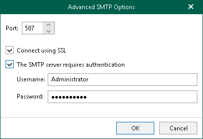
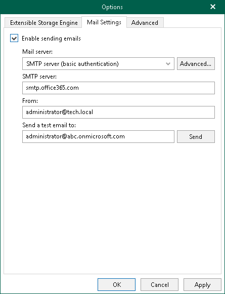

# SMTP Server with Basic Authentication

In this article

To configure sending email messages using an SMTP server with basic authentication, do the following:

1. In the main menu, click General Options.
2. Open the Mail Settings tab.
3. Select the Enable sending emails check box.
4. From the Mail server drop-down list, select SMTP server (basic authentication).
5. Click Advanced to configure advanced settings. You can do the following:

* Specify a port number of an SMTP server that you want to use.

The default port number is 25. If you want to use SSL data encryption, specify port 587.

* Select the Connect using SSL check box to establish a secure connection.

* If an SMTP server requires an authentication for outgoing mail, select the The SMTP server requires authentication check box and provide authentication credentials.

1. In the SMTP server field, specify the address of a server that you want to use as an SMTP server.

By default, Veeam Explorer for Microsoft Exchange establishes a connection to the smtp.office365.com server.

1. In the From field, specify the email address to be shown as a sender.
2. In the Send a test email to field, specify the email address to which Veeam Explorer for Microsoft Exchange sends a test email message.
3. Click Send to send a test email message.
4. Click OK.

Page updated 9/18/2024

Page content applies to build 13.0.1.1071
