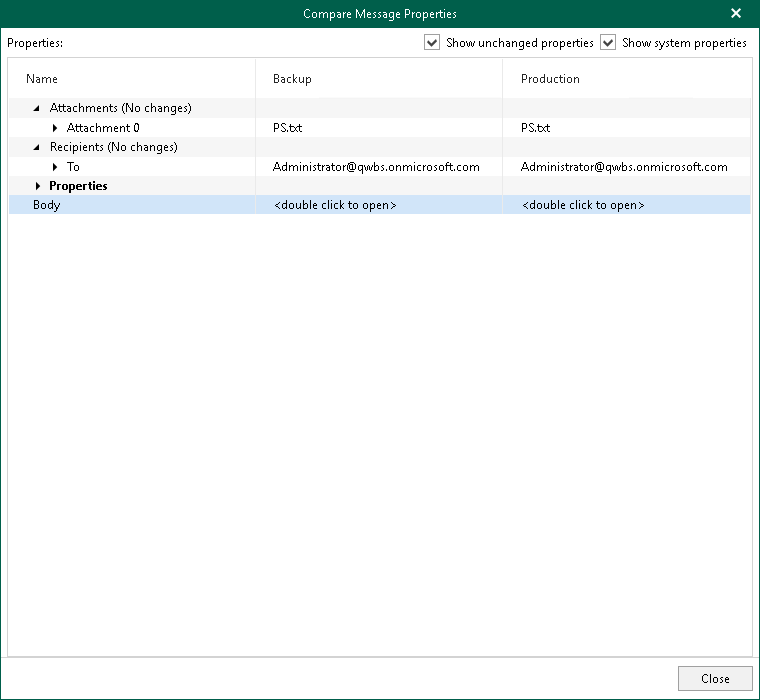

# Data Compare

In this article

You can use Veeam Explorer for Microsoft Exchange to compare data in a backup file with that of the production state.

|  |
| --- |
| Note |
| The Veeam Backup account you want to use for data compare, must have a valid Exchange Online license and an active mailbox within the Microsoft 365 organization. For more information about the required permissions, see [Permissions](vex_required_permissions.md). |

To compare backed-up data with production environment, do the following:

1. In the navigation pane, select an object and click Compare with Production on the ribbon.
2. Proceed to either [Compare to Microsoft 365 Organizations](compare_office365.md) or [Compare to On-Premises Microsoft Servers](compare_to_onprem.md).

1. After the authorization process is complete, click Show Changed Items Only on the ribbon to view only those items that have been changed.

To view the details on what exactly has changed since the last backup, right-click an item and select Compare item properties. The discrepancies will be shown in the Compare Message Properties window. If both objects are equal, nothing will be displayed.

To show unchanged objects, select Show unchanged properties in the top-right corner. To show system properties, select Show system properties.

Double-click Body to see the body message.

To compare a single item, right-click an item and select Compare item properties.

Page updated 10/31/2025

Page content applies to build 13.0.1.1071
