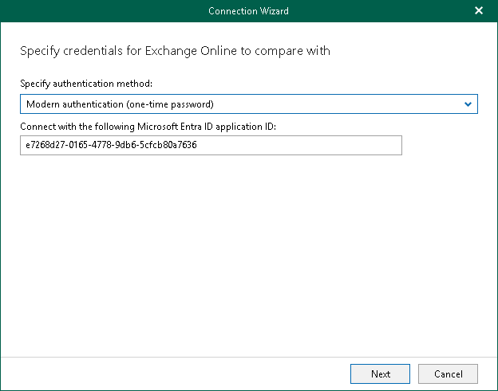
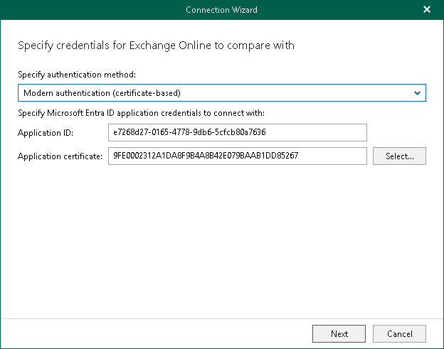
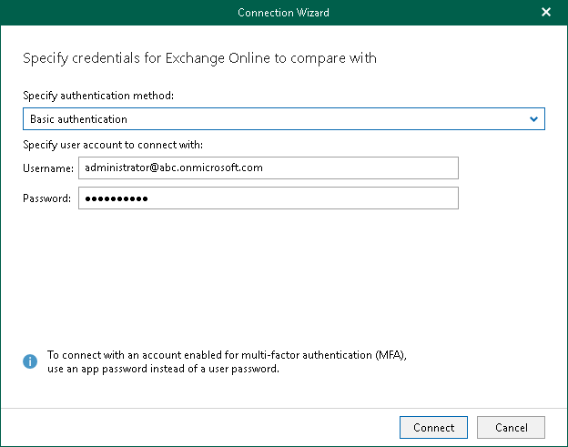

# Step 1. Select Authentication Method

At this step of the wizard, select either modern or basic authentication and specify authentication settings.

Modern Authentication

Modern authentication allows Veeam Backup for Microsoft 365 to use a Microsoft Entra application for data compare. Such an application is used for Microsoft 365 organizations with enabled multi-factor authentication (MFA). For more information, see the [Adding Microsoft 365 Organizations](https://helpcenter.veeam.com/docs/vbo365/guide/vbo_add_office365_org.html?ver=80) section of the Veeam Backup for Microsoft 365 User Guide.

You can also use either modern authentication with the Microsoft Entra application certificate, or modern authentication with one-time authentication code.

Using Modern Authentication with One-Time Authentication Code

To use modern authentication with a one-time authentication code, do the following:

1. From the Specify authentication method drop-down list, select Modern authentication (one-time password).

1. In the Connect with the following Microsoft Entra ID application ID field, enter an identification number of the Microsoft Entra application that you want to use for data compare.

By default, Veeam Explorer for Microsoft Exchange populates this field with the identification number of the application that was used during a backup session. If you want to use another application, make sure to grant this application required permissions. For more information, see the [Microsoft Entra Application Permissions](https://helpcenter.veeam.com/docs/vbo365/guide/azure_ad_applications.html?ver=80) section of the Veeam Backup for Microsoft 365 User Guide.

Using Modern Authentication with Microsoft Entra Application Certificate

|  |
| --- |
| Note |
| If Veeam Explorer for Microsoft Exchange comes as part of a standalone Veeam Backup & Replication installation, modern authentication with the Microsoft Entra application certificate is not available by default. To enable this functionality, install Veeam Explorers from the Veeam Backup for Microsoft 365 installation package (build 7.1.0.2031 or later). For more information on how to install Veeam Explorers on a machine running Veeam Backup & Replication, see the [Installing Veeam Explorers](https://helpcenter.veeam.com/docs/vbo365/guide/vbo_installing_explorers_for_tenants.html?ver=80) section of the Veeam Backup for Microsoft 365 User Guide. |

To use modern authentication with the Microsoft Entra application certificate, do the following:

1. From the Specify authentication method drop-down list, select Modern authentication (certificate-based).
2. In the Application ID field, enter an identification number of the Microsoft Entra application that you want to use for data compare.

By default, Veeam Explorer for Microsoft Exchange populates this field with the identification number of the application that was used during a backup session. If you want to use another application, make sure to grant this application required permissions. For more information, see the [Microsoft Entra Application Permissions](https://helpcenter.veeam.com/docs/vbo365/guide/azure_ad_applications.html?ver=80) section of the Veeam Backup for Microsoft 365 User Guide.

1. Click Select to specify an SSL certificate that you want to use for data exchange between Veeam Explorer for Microsoft Exchange and the specified Microsoft Entra application. This runs the Select Certificate wizard.
2. Proceed to any of the following options:

* [Select certificate from the Certificate Store of this server](https://helpcenter.veeam.com/docs/vbo365/guide/vbo_installing_certificate.html?ver=80#selecting-certificate)
* [Import certificate from a PFX file](https://helpcenter.veeam.com/docs/vbo365/guide/vbo_installing_certificate.html?ver=80#importing-certificate)

Basic Authentication

To use basic authentication, do the following:

1. From the Specify authentication method drop-down list, select Basic authentication.
2. Enter credentials to connect to the Exchange organization and click Connect.

Make that the account that you use has both the Exchange Administrator and the Global Administrator roles.

