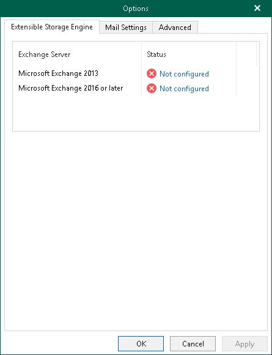

# Extensible Storage Engine

To work with database files, Veeam Explorer for Microsoft Exchange requires a dynamic link library ese.dll which is distributed with Microsoft Exchange.

The ese.dll file must be of the same version as the Microsoft Exchange application that was used to create a database. When restoring a machine that was backed up with application-aware image processing, the ese.dll file will be located automatically.

To specify the path to the ese.dll file, do the following:

1. In the main menu, click General Options.
2. Open the Extensible Storage Engine tab.
3. Click the link next to the Microsoft Exchange version and specify the path to the ese.dll file.

This file can be found on the Microsoft Exchange server distribution CD in the X:\Setup\ServerRoles\Common\ese.dll directory or in the installation directory of the Microsoft Exchange server.

1. Click OK.

