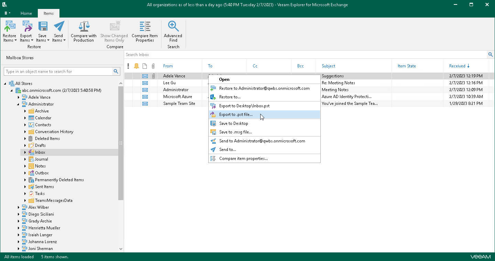
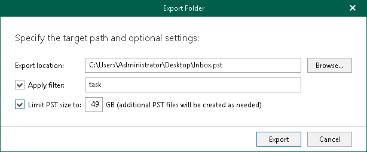
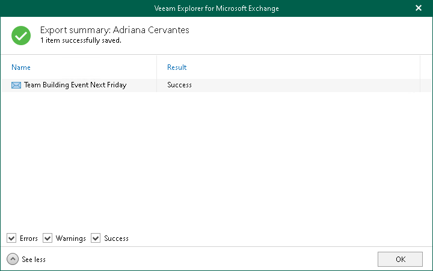

# Exporting to Custom Location

Veeam Explorer for Microsoft Exchange allows you to export mailbox store data to a custom location as PST files.

|  |
| --- |
| Note |
| Export operations require Microsoft Outlook to be installed on the computer running Veeam Explorer for Microsoft Exchange. |

To export objects to a custom location, do the following:

1. Depending on the type of object you want to export, the following actions are available:

* To export a mailbox store or all stores added to the scope, do one of the following:

* In the navigation pane, select a store or the All Stores node, and on the Home tab, click Export Stores > Export to .pst file.
* In the navigation pane, right-click a store or the All Stores node and select Export to .pst file.

* To export a mailbox, do one of the following:

* In the navigation pane, select a mailbox, and on the Mailbox tab, click Export Mailbox > Export to .pst file.
* In the navigation pane, right-click a mailbox and select Export to .pst file.

* To export a folder, do one of the following:

* In the navigation pane, select a folder, and on the Folder tab, click Export Folder > Export to .pst file.
* In the navigation pane, right-click a folder and select Export to .pst file.

* To export an item, do one of the following:

* In the preview pane, select an item and on the Items tab, click Export Items > Export to .pst file.
* In the preview pane, right-click an item and select Export to .pst file.

1. In the Export Folder or Export Mail Items window, do the following:

1. In the Export location field, specify the name and location for the new PST file.

|  |
| --- |
| Note |
| If mailbox store data are exported as PST files to a shared folder, you must check whether a user who performs the export operation has sufficient permissions to write into this folder. |

1. Select the Apply filter check box and enter keywords to export only those items that match specified criteria. To provide multiple keywords, use the OR logical operator as the delimiter.

Veeam Explorer for Microsoft Exchange will check for the specified keywords in all fields such as From, To, Subject and Body.

The Apply filter option is only available when exporting folders and mailboxes, not items.

1. Select the Limit PST size to check box and specify the size of which to export PST files. The specified value must be between 1 GB and 49 GB.

With this option, Veeam Explorer for Microsoft Exchange will create multiple PST files as of the specified size.

After the export process is complete, review the results shown in the Export summary window. To do this, click See more to expand the window and review details of the export operation. You can filter notifications by their status: Error, Warning or Success.

