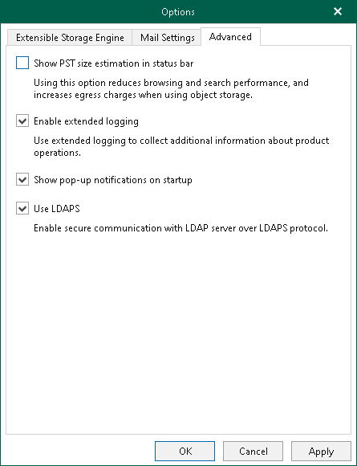

# Advanced Settings

In this article

Veeam Explorer for Microsoft Exchange allows you to configure advanced settings such as extended logging mode, pop-up notifications and PST size availability.

To configure advanced settings, do the following:

1. In the main menu, click General Options.
2. Open the Advanced tab.

1. If you want to see the estimated size of the Outlook database file in the status bar, select the Show PST size estimation in status bar check box.
2. If you want to enable extended logging mode to collect logs that contain additional information on specific operations, select the Enable extended logging check box. After enabling extended logging mode, you can go back to the application and perform actions for which you want to collect additional information. Then you can collect logs. For more information on log collection, see [Getting Support](vex_support.md).

1. By default, Veeam Explorer for Microsoft Exchange displays notifications when loading backups created by Veeam Backup for Microsoft 365 from object storage repository. If you want to disable these notifications, clear the Show pop-up notifications on startup check box.
2. By default, Veeam Explorer for Microsoft Exchange uses the LDAP protocol to communicate with Microsoft Exchange on the target server. To enable the more secure LDAPS protocol (LDAP over SSL/TLS), select the Use LDAPS check box. This option also prevents failover to the LDAP protocol if LDAPS is not available.
3. Click OK.

Page updated 8/14/2025

Page content applies to build 13.0.1.1071
