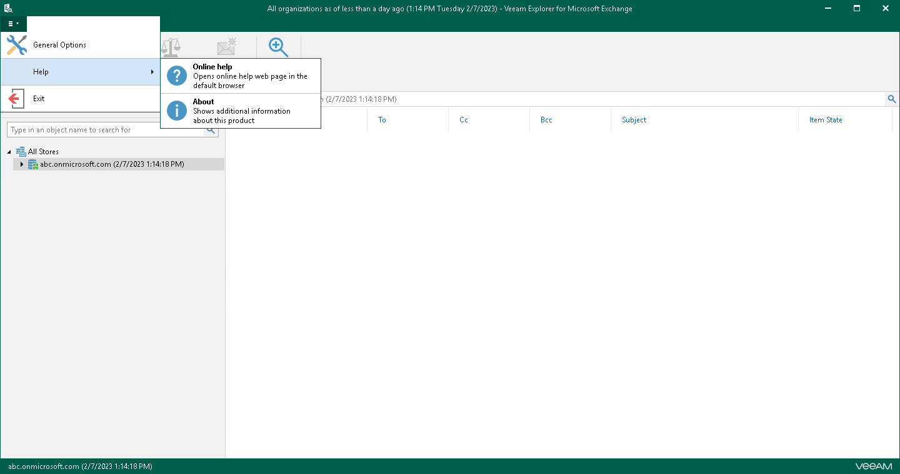
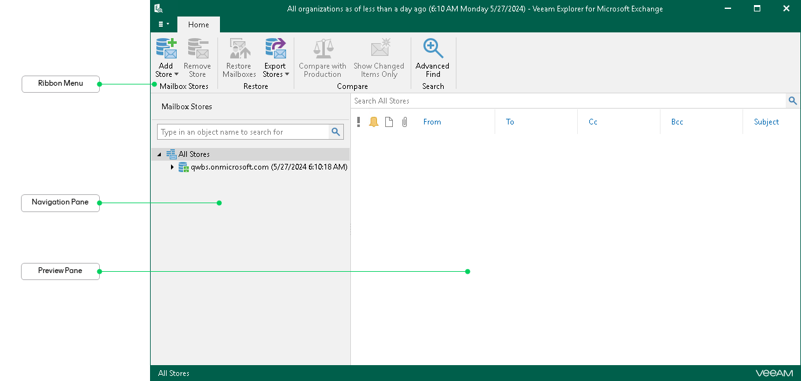

# Getting to Know User Interface

The user interface of Veeam Explorer for Microsoft Exchange is designed to let you quickly find commands that you need to restore and export Microsoft Exchange data from backups created by Veeam Backup for Microsoft 365 and Veeam Backup & Replication.

Main Menu

The main menu comprises the following options:

* General Options. Allows you to configure general application settings. For more information, see [General Application Settings](vex_configuring.md).
* Help.

* Online help. Opens the online help page.
* About. Shows the additional information including build number.

* Exit. Closes the Veeam Explorer for Microsoft Exchange window.

|  |
| --- |
| Tip |
| To open online help, press [F1] in any Veeam Explorer for Microsoft Exchange wizard or window. You will then be redirected to the relevant section of the user guide. |

Main Application Window

The main application window contains the following UI elements:

* The ribbon menu, which contains operation commands organized into logical groups represented as tabs. The ribbon menu is displayed at the top of the main application window.
* The navigation pane, which allows you to browse through the hierarchy of folders with backed-up data. Also, it allows you to search for mailboxes using keywords.
* The preview pane, which provides search capabilities and allows you to view details about items that are contained in a folder you have selected in the navigation pane.

