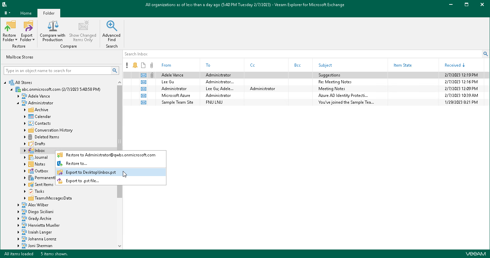
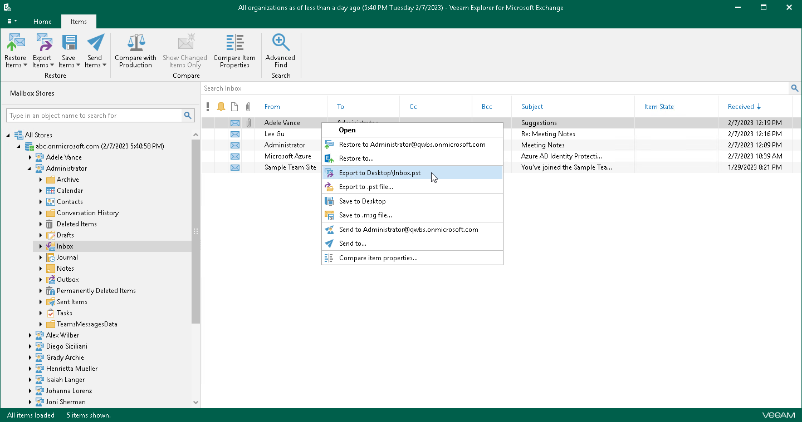
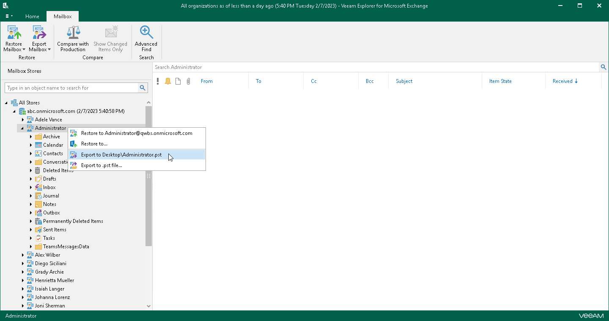
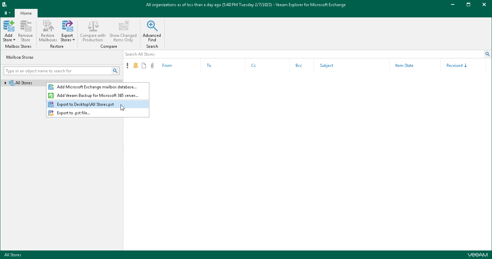

# Using 1-Click Export

Veeam Explorer for Microsoft Exchange allows you to quickly export mailbox store data as PST files.

|  |
| --- |
| Note |
| Export operations require Microsoft Outlook to be installed on the computer running Veeam Explorer for Microsoft Exchange. |

Depending on the type of object you want to export, the following actions are available:

* To export a folder, do one of the following:

* In the navigation pane, select a folder, and on the Folder tab, click Export Folder > Export to <default\_location>\<original\_folder\_name>.pst.
* In the navigation pane, right-click a folder and select Export to <default\_location>\<original\_folder\_name>.pst.

* To export an item, do one of the following:

* In the preview pane, select an item and on the Items tab, click Export Items > Export to <default\_location>\<original\_folder\_name>.pst.
* In the preview pane, right-click an item and select Export to <default\_location>\<original\_folder\_name>.pst.

* To export a mailbox, do one of the following:

* In the navigation pane, select a mailbox, and on the Mailbox tab, click Export Mailbox > Export to <default\_location>\<original\_mailbox\_name>.pst.
* In the navigation pane, right-click a mailbox and select Export to <default\_location>\<original\_folder\_name>.pst.

* To export a mailbox store or all stores added to the scope, do one of the following:

* In the navigation pane, select a store or the All Stores node, and on the Home tab, click Export Stores > Export to <default\_location>\<original\_store\_name>.pst.
* In the navigation pane, right-click a store or the All Stores node and select Export to <default\_location>\<original\_store\_name>.pst.

After the export process is complete, review the results shown in the Export summary window. To do this, click See more to expand the window and review details of the export operation. You can filter notifications by their status: Error, Warning or Success.

