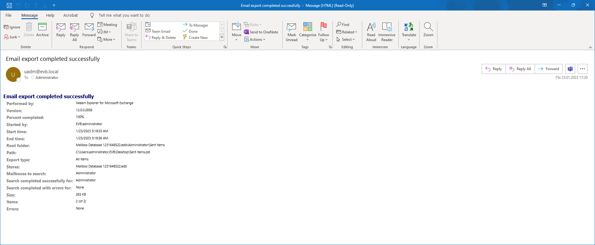

# Receiving Export Reports

Veeam Explorer for Microsoft Exchange can deliver reports that show summary information about export operations.

Consider the following:

* If you want export reports to be delivered, make sure to configure mail settings in Veeam Explorer for Microsoft Exchange or Veeam Backup & Replication notification settings.

For more information, see [Mail Settings](vex_mail_settings.md) and [Configuring Global Email Notification Settings](general_email_notifications.md).

* A server with Veeam Explorer for Microsoft Exchange and Veeam Backup & Replication must be in a domain.
* Export reports are delivered automatically upon each export session.

You can use [Exporting to Custom Location](vex_export_custom.md) or [Using 1-Click Export](vex_one_click_export.md).

* Keep in mind the following when specifying recipients of the report:

* The recipient is always the current user account under which Veeam Explorer for Microsoft Exchange is running when using only Veeam Explorer for Microsoft Exchange notification settings.
* The recipient is always the user account provided in Veeam Backup & Replication notification settings when using only Veeam Backup & Replication settings.
* If you have configured both Veeam Explorer for Microsoft Exchange and Veeam Backup & Replication notification settings, the report will be sent to both recipients.

|  |
| --- |
| Note |
| If you [export Microsoft Exchange data using PowerShell cmdlets](https://helpcenter.veeam.com/docs/vbo365/explorers_powershell/export-vexitem.html?ver=80) and you have a restore session started for Veeam Backup for Microsoft 365, the report will only be sent to the user account provided in Veeam Explorer for Microsoft Exchange notification settings. |

The following table lists fields that are shown in the report.

| Report field | Description |
| --- | --- |
| Performed by | Veeam Explorer for Microsoft Exchange |
| Version | Shows the Veeam Explorer for Microsoft Exchange build number. |
| Percent completed | Shows the number of items included in the PST file. |
| Started by | Shows the user account generated the report. |
| Start time, End time | Shows the creation time of a report. |
| Root folder | Shows the object path. |
| Path | Shows the path to the database file. |
| Export type | Shows the export type. |
| Stores | Shows a datastore name from which items have been exported. |
| Mailboxes to search | Shows a mailbox name from which items have been exported. |
| Search completed successfully for, Search completed with errors for | Shows results for mailboxes to search. |
| Size | Shows the total size of exported items. |
| Items | Shows the number of exported items. |
| Errors | Shows errors that occurred during export. |

