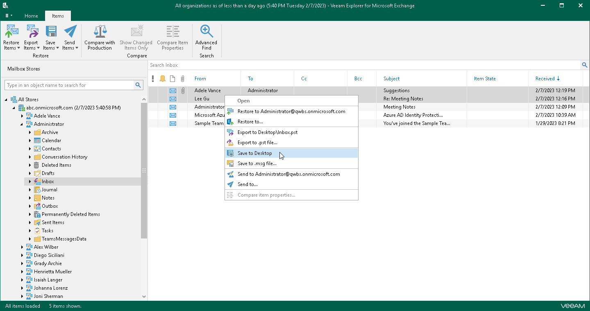
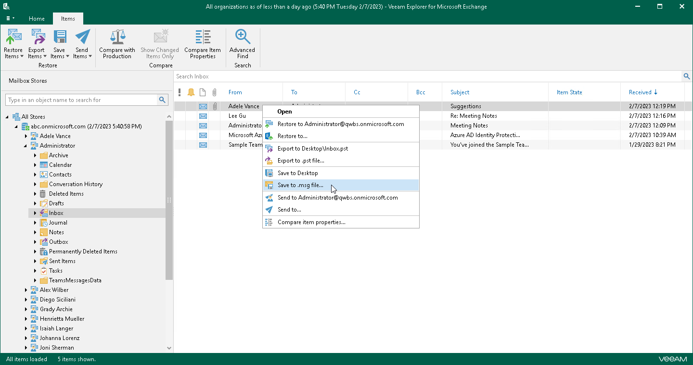

# Saving Microsoft Exchange Items

Veeam Explorer for Microsoft Exchange allows you to save any item as Microsoft Exchange Mail Document (.msg) files.

1-Click Save

To save your Exchange data, do the following:

1. In the navigation pane, select a folder containing required items.
2. In the preview pane, select items that you want to save and do one of the following:

* On the Items tab, click Save Items > Save to <folder\_name>.
* Right-click the selection and select Save to <folder\_name>.

Use the search field to find particular items.

A <folder\_name> name depends on the latest location that was used when saving items.

Saving to Custom Location

To save items to a custom location, do the following:

1. In the navigation pane, select a folder.
2. In the preview pane, do one of the following:

* Select an item, and on the Items tab, click Save Items > Save to .msg file.

* Right-click an item and select Save to .msg file.

|  |
| --- |
| Note |
| If mailbox items are saved to a shared folder, you must check whether a user who performs the save operation has sufficient permissions to write into this folder. |

