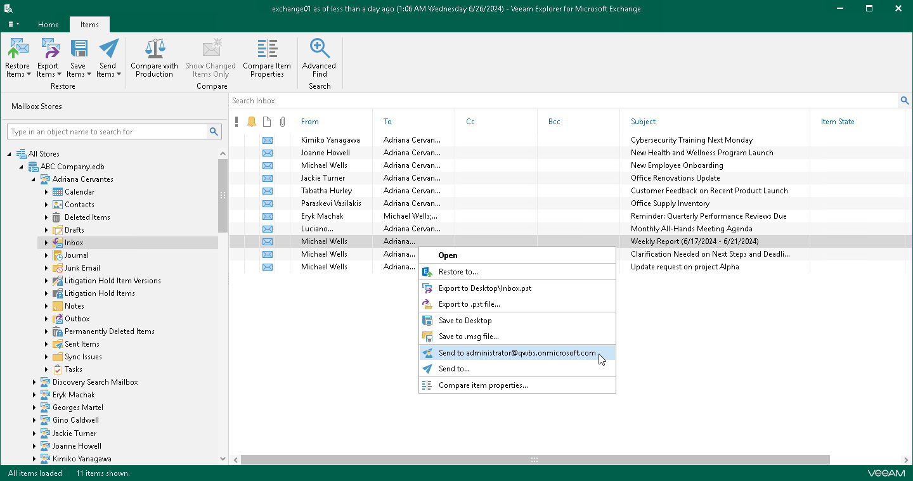
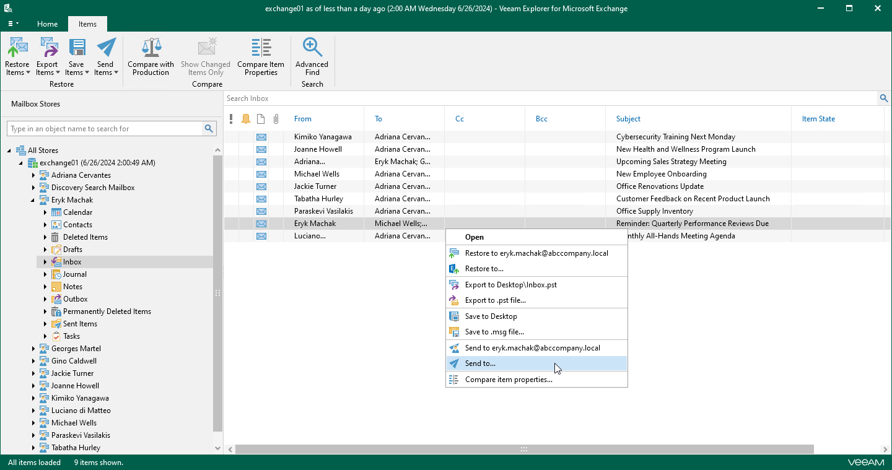
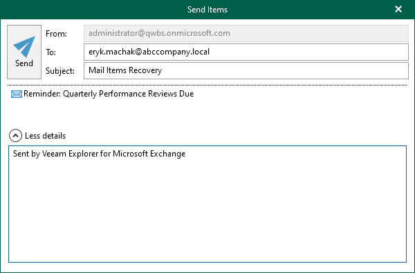

# Sending Microsoft Exchange Items

In this article

Veeam Explorer for Microsoft Exchange allows you to send Exchange items by email.

|  |
| --- |
| Note |
| Before sending documents, make sure to configure mail settings. The amount of data you can send at a time depends on your SMTP server configuration. For more information about configuring mail settings, see [Mail Settings](vex_mail_settings.md). |

1-Click Send

To send items to the original mailbox, do the following:

1. In the navigation pane, select a folder containing the required items.
2. In the preview pane, do one of the following:

* Select an item, and on the Items tab, click Send Items > Send to <mailbox\_name>.

* Right-click an item and select Send to <mailbox\_name>.

|  |
| --- |
| Note |
| Consider the following:   * When sending an item from a Veeam Backup & Replication backup, the item will be sent to the address specified in the From field in the [Mail Settings](vex_mail_settings.md). * When sending an item from a Veeam Backup for Microsoft 365 backup, the item will be sent to the selected mailbox. |

Sending to Custom Recipient

To send items to a specific recipient, do the following:

1. In the navigation pane, select a folder containing the required items.
2. In the preview pane, select items that you want to send and do one of the following:

* On the Items tab, click Send Items > Send to.
* Right-click the selection and select Send to.

Use the search field to find particular items.

1. In the Send Items window, provide a recipient address and click Send.

The From field is filled automatically based on the address you have provided when configuring mail settings. For more information, see [Mail Settings](vex_mail_settings.md).

You can also edit the message subject and body. To edit the message body, click More details.

Page updated 10/31/2025

Page content applies to build 13.0.1.1071
