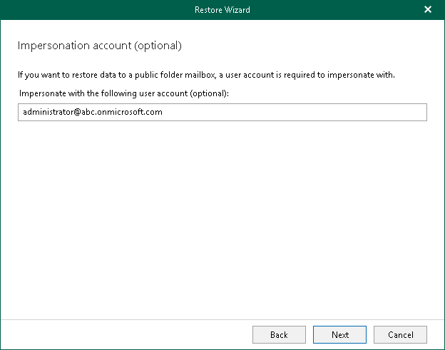

# Step 5. Specify Impersonation Account

This step is only available if you have selected the Modern Authentication (certificate-based) option at the [Select Authentication Method](vex_vbr_restore_ms365_single_select_authentication_method.md#certificate) step.

If you want to restore your data to a public folder mailbox, you can optionally specify a user account to impersonate with this public folder mailbox.

