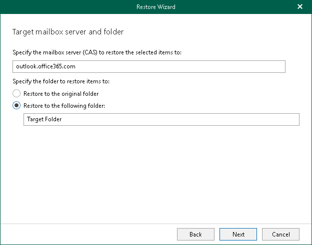

# Step 6. Specify CAS Server and Target Folder

This step is only available if you have selected the Basic Authentication option at the [Select Authentication Method](vex_vbr_restore_ms365_single_select_authentication_method.md#basic) step.

At this step of the wizard, specify a CAS server and provide a folder to which you want to restore data. You can restore your data to the original folder or specify a custom folder.

To provide a CAS server and target folder, do the following:

1. Specify a CAS server DNS name or IP address.

This field is populated automatically with the CAS server address from your domain. You can also enter a CAS server manually.

1. Select a folder to which you want to restore data. You can restore your data to the original folder or specify a custom folder.

When you select to restore to a custom folder, Veeam Explorer for Microsoft Exchange checks if the specified folder exists, if not, it creates a folder automatically. For example, if you specify a path like Folder1/Folder2/Folder3, Veeam Explorer for Microsoft Exchange will restore your data to the Folder3. You can use both the slash ("/") and the backslash ("\") characters when specifying a path.

