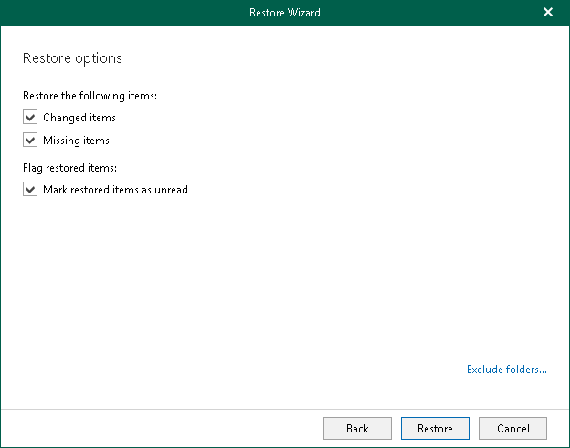

# Step 8. Specify Restore Options

At this step of the wizard, select restore options and click Restore.

You can select the following options:

* Changed items

Select this check box if you want to restore items that have been changed. When you select this option, Veeam Explorer for Microsoft Exchange overwrites existing items in your target location.

* Missing Items

Select this check box if you want to restore items that are missing in your target location. For example, some of the items were removed and you want to restore them from the backup.

* Mark restored items as unread

Select this check box if you want to mark each restored item as unread.

If you restore a mailbox, to prevent certain folders from being restored, click the Exclude folders link and select folders to exclude.

|  |
| --- |
| Note |
| The Exclude folders link is not available when restoring folders and items. |

