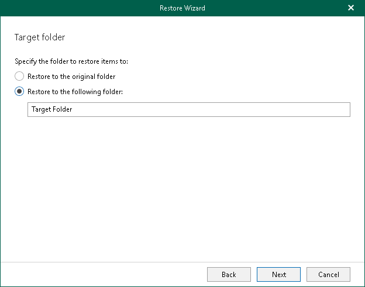

# Step 7. Specify Target Folder

In this article

This step is only available if you have selected the Modern Authentication (one-time password) or the Modern authentication (certificate-based) option at the [Select Authentication Method](vex_vbr_restore_ms365_single_select_authentication_method.md) step.

At this step of the wizard, select a target folder to which you want to restore the [specified mailbox](vex_vbr_restore_ms365_single_target_mailbox.md). You can restore your data to the original folder or specify a custom folder.

When you select to restore to a custom folder, Veeam Explorer for Microsoft Exchange checks if the specified folder exists, if not, it creates a folder automatically. For example, if you specify a path like Folder1/Folder2/Folder3, Veeam Backup for Microsoft 365 will restore your data to the Folder3. You can use both the slash ("/") and the backslash ("\") characters when specifying a path.

Page updated 8/1/2024

Page content applies to build 13.0.1.1071
