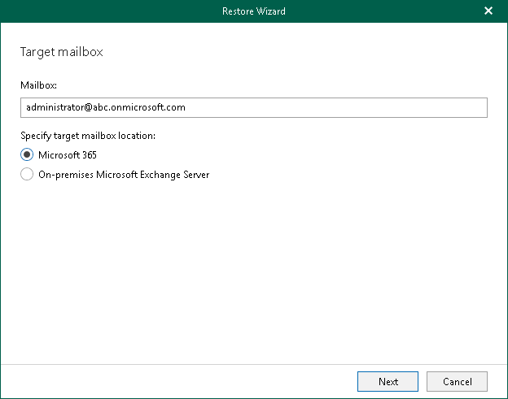

# Step 2. Specify Target Mailbox

At this step of the wizard, specify the target mailbox and mailbox location.

To specify mailbox settings, do the following:

1. In the Mailbox field, enter a mailbox name to which you want to restore data.

You can specify any name that you want. You can also restore a mailbox to a different organization. For example, you have backed up a mailbox administrator@abc.onmicrosoft.com. To restore such a mailbox to a different organization, you can specify, for example, administrator@xyz.onmicrosoft.com to restore a mailbox to the xyz.onmicrosoft.com organization.

1. Select Microsoft 365 to restore the specified mailbox to an Exchange Online organization with enabled multi-factor authentication (MFA). For more information, see the [Adding Microsoft 365 Organizations](https://helpcenter.veeam.com/docs/vbo365/guide/vbo_add_office365_org.html?ver=80) section of the Veeam Backup for Microsoft 365 User Guide.

You can also restore from backups created for Exchange Online organizations to on-premises Microsoft Exchange servers and vice versa. For more information, see [Restore to On-Premises Microsoft Servers](restore_to_onprem.md).

