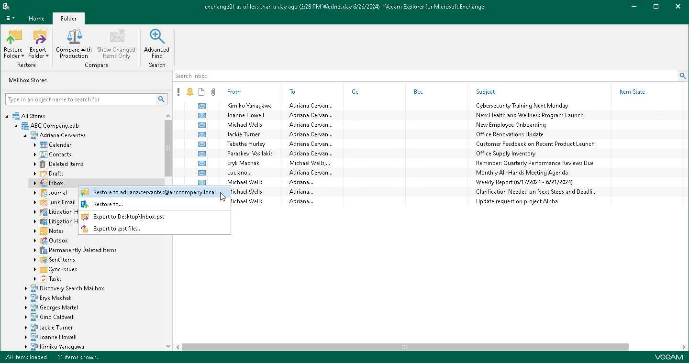
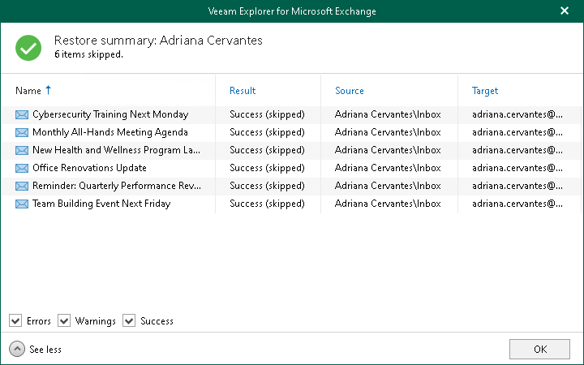

# 1-Click Restore

In this article

The 1-Click Restore feature allows you to quickly restore Exchange mailboxes, folders and items according to the following:

* The original Exchange server, original folder and the original mailbox name are restored.
* Both changed and missing items are restored.
* Restored items are marked as unread.
* No folders are excluded.

You can use 1-Click Restore when you do not want to configure a restore session and prefer to restore data with the default settings.

|  |
| --- |
| Important |
| 1-Click Restore from Veeam Backup & Replication backups is only available if the following conditions are met:   * The machine where  Veeam Explorer for Microsoft Exchange is opened must be within the same domain as the Microsoft Exchange server. * The account used to run Veeam Explorer for Microsoft Exchange must exist within the same domain as the Microsoft Exchange server. |

Depending on the type of object you want to restore, to launch the Restore wizard, the following actions are available:

* If you want to restore a mailbox, do one of the following:

* In the navigation pane, select a mailbox that you want to restore, and on the Mailbox tab, click Restore Mailbox > Restore to <mailbox\_name>.
* In the navigation pane, right-click a mailbox that you want to restore and select Restore to <mailbox\_name>.

* If you want to restore a folder, do one of the following:

* In the navigation pane, select a folder that you want to restore, and on the Folder tab, click Restore Folder > Restore to <mailbox\_name>.
* In the navigation pane, right-click a folder that you want to restore and select Restore to <mailbox\_name>.

* If you want to restore an item, do one of the following:

* In the preview pane, select an item that you want to restore, and on the Items tab, click Restore Item > Restore to <mailbox\_name>.
* In the preview pane, right-click an item that you want to restore and select Restore to <mailbox\_name>.

|  |
| --- |
| Note |
| Before the restore process begins, you will be prompted to enter the source machine credentials. |

After the restore process is complete, review the results shown in the Restore summary window. To do this, click See more to expand the window and review details of the restore operation. You can filter notifications by their status: Error, Warning or Success.

Page updated 8/21/2025

Page content applies to build 13.0.1.1071
