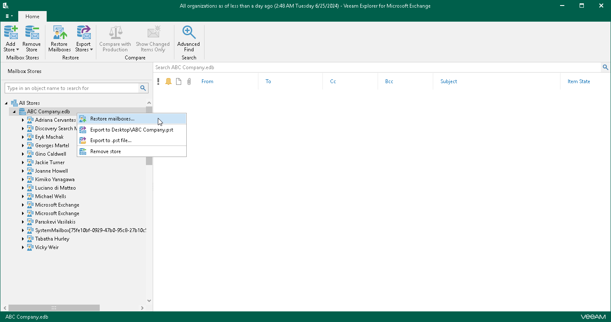

# Step 1. Launch Restore Wizard

In this article

To launch the Restore wizard, do one the following:

* In the navigation pane, select an organization whose mailboxes you want to restore, and on the Home tab, click Restore Mailboxes.

* In the navigation pane, right-click an organization and select Restore mailboxes.

Page updated 9/18/2024

Page content applies to build 13.0.1.1071
