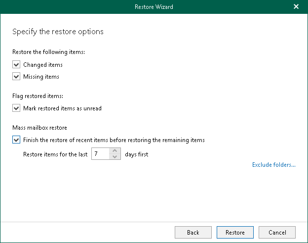

# Step 5. Select Restore Options

At this step of the wizard, select restore options and click Restore.

You can select the following options:

* Changed items

Select this check box if you want to restore items that have been changed. When you select this option, Veeam Explorer for Microsoft Exchange overwrites existing items in your target location.

* Missing Items

Select this check box if you want to restore items that are missing in your target location. For example, some of the items were removed and you want to restore them from the backup.

* Mark restored items as unread

Select this check box if you want to mark each restored item as unread.

When restoring multiple mailboxes, select the Finish the restore of recent items before restoring the remaining items check box and set the value in the Restore items for the last <N> days first field to restore multiple mailboxes in "chunks", when the most recent items in the backup will be processed first.

To prevent certain folders from being restored, click the Exclude folders link and select folders to exclude.

