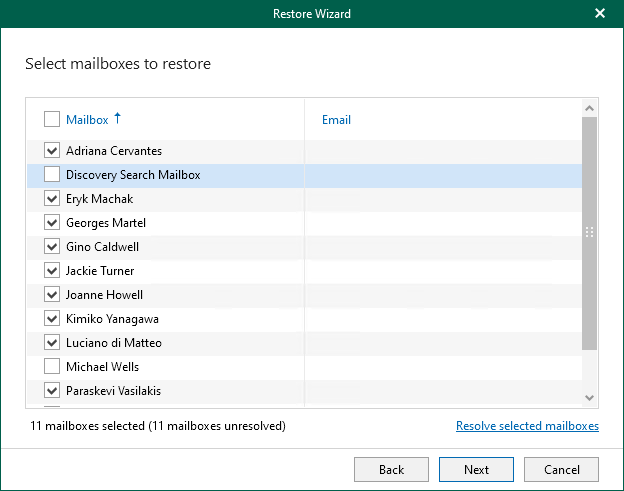

# Step 3. Select Mailboxes to Restore

In this article

At this step of the wizard, select mailboxes that you want to restore.

To see the full email address in the Email column, click Resolve selected mailboxes.

Page updated 6/26/2024

Page content applies to build 13.0.1.1071
