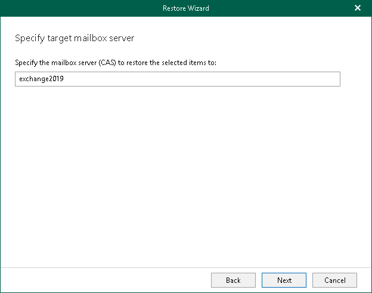

# Step 4. Specify Target Mailbox Server

In this article

At this step of the wizard, specify the DNS name or IP address of the target server to which you want to restore mailboxes.

Page updated 3/5/2025

Page content applies to build 13.0.1.1071
