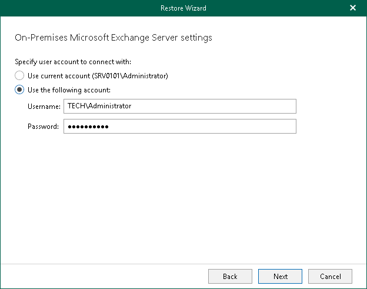

# Step 3. Specify User Account

In this article

At this step of the wizard, specify an account that you want to use to connect to the Exchange server in your domain.

Page updated 5/16/2024

Page content applies to build 13.0.1.1071
