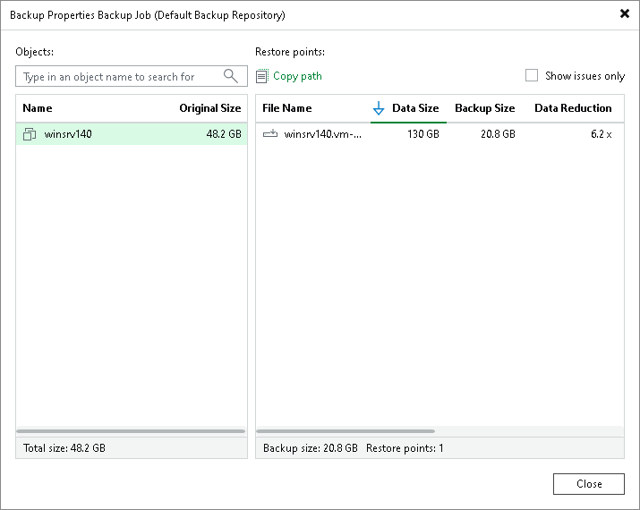

# Viewing Backup Properties

In this article

You can view summary information about created backups. The summary information provides the following data:

* Available restore points.
* Date of restore points creation.
* Compression and deduplication ratios.
* Data size (amount of data before compression and deduplication), backup size (actual, physical amount of data stored in the repository after compression and deduplication), original size (size of the selected VM) and total size (sum of all the original sizes displayed in Objects).
* GFS retention policy applied to restore points (W — weekly; M — monthly; Y — yearly).
* Backup retention date. This column is available for backups created by [VeeamZIP](veeamzip.md), [export backup](exporting_backups_hv.md) or [copy backup](copy_backup_hv.md) and with the retention period specified.

In the Backup Properties window, you can see different icons whose meaning is described in the [Infrastructure Icons](infrastructure_icons.md#restore_points) section.

To view summary information for backups:

1. Open the Home view.
2. In the [inventory pane](vbr_ui.md), select Backups.
3. In the working area, right-click the backup and select Properties.
4. To see the list of available restore points, select the required object from the Objects list.

Page updated 2/18/2025

Page content applies to build 13.0.1.1071
