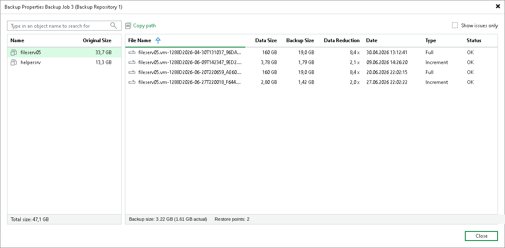

# Viewing Backup Properties in Scale-Out Backup Repositories

For backups stored in a scale-out backup repository, the actual size shown depends on the node you select:

* Backups — contains the sum of all backups across the performance, capacity and archive tiers.
* Object Storage — contains the actual size of the backups stored on the performance tier. This node displays the size of a backup for a standalone object storage repository and for the performance tier extent. For more information, see [Block Reuse](object_storage_repository.md#block_reuse).
* Capacity Tier — contains the actual size of the backups stored on the capacity tier.
* Archive Tier — contains the actual size of the backups stored on the archive tier.

At the bottom, Veeam Backup & Replication displays the backup size for the selected object as follows:

* Backup size — displays the logical size before optimization.
* Actual size — displays the actual size of backups after block reuse is applied.

For example: Backup size: 3.22 GB (1.61 GB actual).

.

Page updated 2026-07-29

