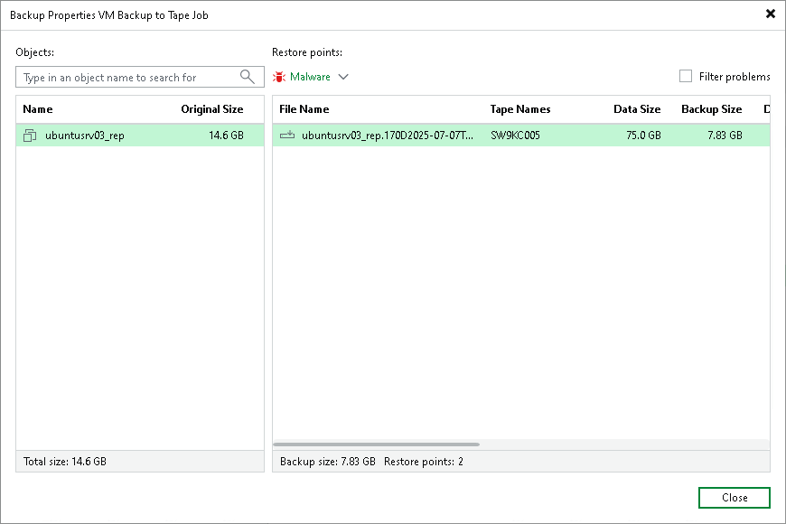

# Viewing Backups on Tape

After the backup to tape job completes, you can view the created archive on tape:

1. Open the Home view.
2. In the Inventory pane, select Backups > Tape.
3. In the working area, right-click the backup to tape job and select Properties.

