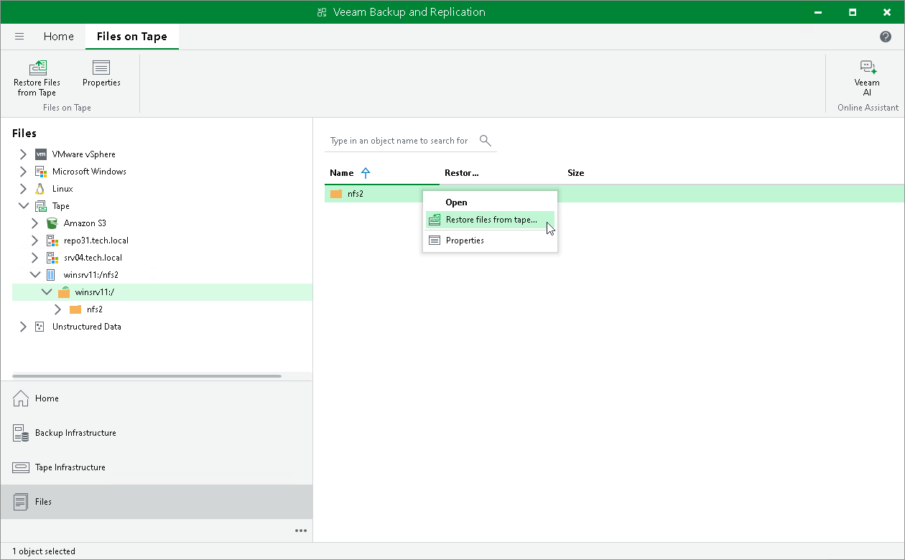
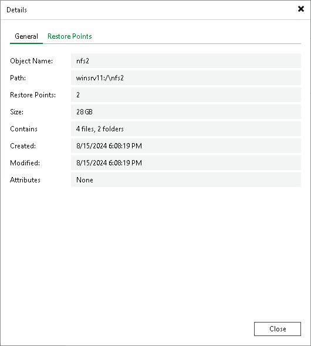
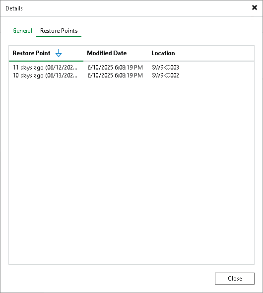

# Viewing Files and Objects on Tape

In this article

After the file to tape job or object to tape job completes, you can view the created archive on tape:

1. Open the Files view and press F5 to refresh it.
2. Expand the Tape node and locate the files or object storage archive.

For Microsoft Windows and Linux file backups, Veeam Backup & Replication preserves the source hierarchy of folders for archived files.

For object storage backups, Veeam Backup & Replication preserves the source prefix structure for archived objects.

For NMDP backups, you can view only volumes.

You can use the created archives for file and object storage data recovery. Right-click a file or an object and select Restore files from tape to launch the Restore from Tape wizard. For more information, see [File Restore from Tape](file_restore_from_tape.md) and [Object Restore from Tape](object_restore_from_tape.md).

|  |
| --- |
| Note |
| Consider the following:   * The Files on Tape view displays only first 1000 items. For archive folders with more than 1000 items, you can use the search field to display the items you are looking for. * For files or objects with multiple restore points, the Size column specifies only the size of the latest restore point of the file or object. |

Viewing File and Object Properties

You can view summary information about the selected object or file archived to tape. The summary information provides the following data:

* Path to the source file or object.
* Size of the archived file or object.
* Dates of the archive creation and last modification.
* Available restore points: date of their creation and tapes they were archived to.

To view summary information for files and objects:

1. Open the Files view.
2. Expand the Tape node and locate the files or object storage archive.
3. Right-click the file or object and select Properties.

1. To see the list of available restore points, open the Restore Points tab.

Page updated 4/29/2024

Page content applies to build 13.0.1.1071
