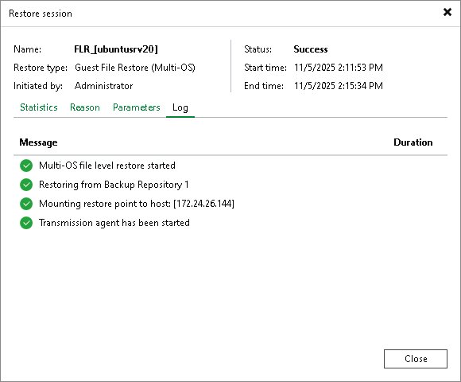

# Viewing File Restore Session Statistics

In this article

You can view statistics about performed guest OS file restore sessions.

To view the restore session statistics, do one of the following:

* Open the Home view. In the inventory pane select Last 24 hours. In the working area, double-click the necessary restore session. Alternatively, you can select the session and click Statistics on the ribbon or right-click the session and select Statistics.
* Open the History view. In the inventory pane select Restore. In the working area, double-click the necessary restore session. Alternatively, you can select the session and click Statistics on the ribbon or right-click the session and select Statistics.

The file restore statistics provide detailed data on file restore sessions:

* At the top of the Restore Session window, Veeam Backup & Replication shows general session statistics: the name of the machine whose guest OS files are recovered during the session, the user name of the account under which the session was started, session status and duration details.

* The Statistics tab shows detailed information about the files recovered during the session.
* The Reason tab shows the reason for the guest OS file restore that was specified at the Reason step of the File Level Restore wizard.
* The Parameters tab shows information about the restore point selected for the guest OS file restore at the Restore Point step of the File Level Restore wizard.
* The Log tab shows a list of operations performed during the session.

Page updated 11/19/2025

Page content applies to build 13.0.1.1071
